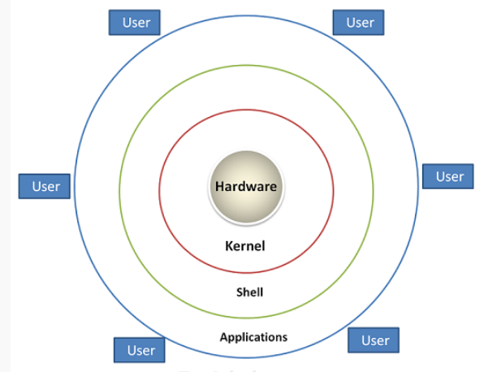
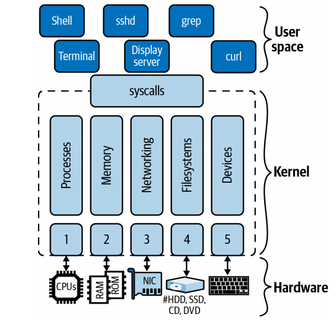

# Linux Architecture
Linux is built on a modular architecture, which means that it is made up of a number of different components that work together to form a complete operating system. These components are organized into layers, each of which serves a specific purpose and interacts with the other layers to provide the functionality that users expect from an operating system.<br>



### The following is a high-level overview of the main layers of the Linux architecture:
- **Hardware layer:**<br>
    This is the bottommost layer of the Linux architecture and represents the physical hardware components of the computer, such as the processor, memory, and storage. The hardware layer is responsible for interacting with the various hardware devices and providing access to them for the rest of the operating system.
- **Kernel layer:**<br>
    The kernel is the core of the operating system and is responsible for managing the resources of the computer, such as the CPU, memory, and I/O devices. It also provides services to the other components of the operating system and acts as the intermediary between the hardware and the software layers.
- **System libraries layer:**<br>
    This layer consists of a set of libraries that provide functions for the applications to use. These libraries include system calls, which are used to invoke kernel functions, as well as other functions that perform tasks such as file manipulation, networking, and memory management.
- **System utilities layer:**<br>
    This layer consists of a set of programs that perform various system-level tasks, such as managing processes, controlling user accounts, and configuring system settings. These utilities are usually command-line programs that are invoked by the user or by other programs
- **Applications layer:**<br>
    This is the topmost layer of the Linux architecture and consists of the various applications that run on the operating system. These can be anything from productivity software and games to web browsers and media players.

### The interfaces between the different layers are well defined and part of the Linux operating system package.
    Between the kernel and user land is the interface called (system calls) (syscalls for short).

### The interface between the hardware and the kernel is, unlike the syscalls, not a single one.
### It consists of a collection of individual interfaces, usually grouped by hardware:
    1. The CPU interface 
    2. The interface with the main memory
    3. Network interfaces and drivers (wired and wireless)
    4. Filesystem and block devices driver interfaces
    5. Character devices, hardware interrupts, and device drivers, for input devices like keyboards, terminals, and other I/O 

## As you can see,
    Many of the things we usually consider part of the Linux operating system, such as shell or utilities such as grep, find, and ping, are in fact not part of the kernel but, very much like an app you download, part of user land.

On the topic of user land, you will often read or hear about user versus kernel mode.
This effectively refers to how privileged the access to hardware is and how restricted
the abstractions available are.

In general, kernel mode means fast execution with limited abstraction, whereas user mode means comparatively slower but safer and more convenient abstractions, Unless you are a **kernel developer**.<br>
You can almost always ignore kernel mode, since all your apps will run in user land. Knowing how to interact with the kernel `sys-calls` , on the other hand, is vital and part of our considerations.

# CPU Architectures
The fact that Linux runs on a large number of different CPU architectures is arguably one of the reasons it is so popular.

Next to generic code and drivers, the Linux kernel contains architecture-specific code. This separation allows it to port Linux and make it available on new hardware quickly.

### There are a number of ways to figure out what CPU your Linux is running. I will show you one of them.
You could try the following (output shortened):
```bash
$ lscpu
Architecture: x86_64 
CPU op-mode(s): 32-bit, 64-bit
Byte Order: Little Endian
Address sizes: 40 bits physical, 48 bits virtual
CPU(s): 4
On-line CPU(s) list: 0-3
Thread(s) per core: 1
Core(s) per socket: 4
Socket(s): 1
NUMA node(s): 1
Vendor ID: GenuineIntel
CPU family: 6
Model: 60
Model name: Intel Core Processor (Haswell, no TSX, IBRS)
Stepping: 1
CPU MHz: 2592.094
```
In the previous command, we saw that the CPU architecture was reported to be **x86_64**, and the model was reported as “**Intel Core Processor (Haswell).**”

Another way to glean similar architecture information is by using `cat /proc/cpuinfo`, or, if you’re only interested in the architecture, by simply calling `uname -m`.

### There are also different architectures like: 
- ARM Architecture
- RISC-V Architecture