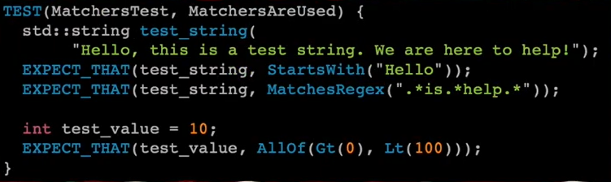
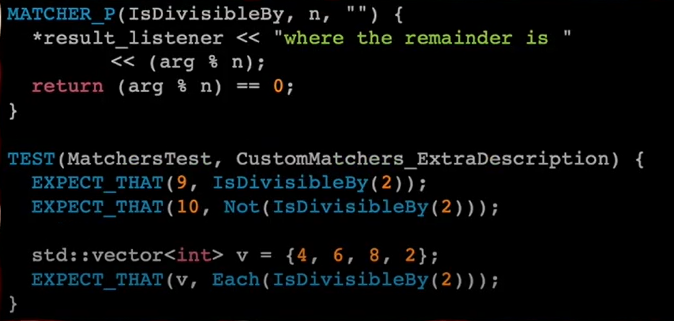
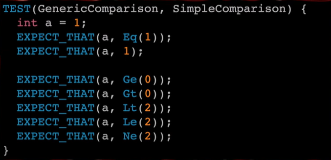
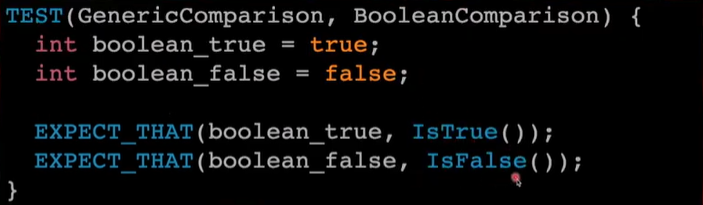
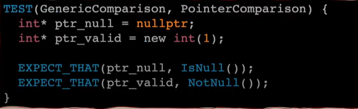
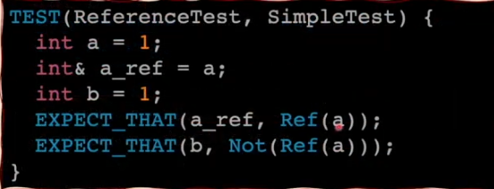
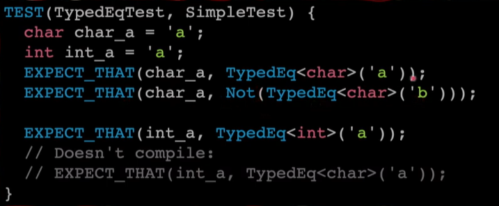
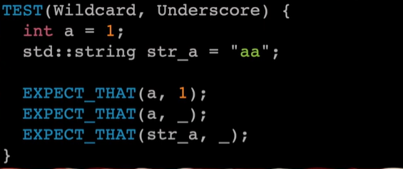
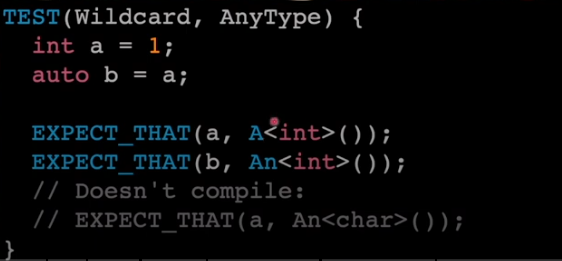
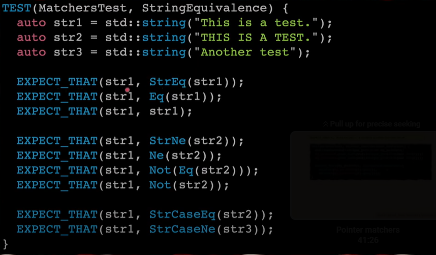

# This Documentation contains the following:
- [This Documentation contains the following:](#this-documentation-contains-the-following)
- [Matchers](#matchers)
- [Why use Matchers?](#why-use-matchers)
- [Comparison Matchers](#comparison-matchers)
  - [Generic and Numeric Comparison](#generic-and-numeric-comparison)
  - [Boolean and Pointer Comparison](#boolean-and-pointer-comparison)
  - [Reference Matcher](#reference-matcher)
  - [TypedEq Matcher](#typedeq-matcher)
  - [Wildcard](#wildcard)
- [String Matchers](#string-matchers)

# Matchers
A **matcher** matches a single argument.
| **Macro** | **Description**  |
| --------- | ---------------- |
| `EXPECT_THAT(actual_value, matcher)`	| Asserts that actual_value matches matcher. |
| `ASSERT_THAT(actual_value, matcher)`  |The same as EXPECT_THAT(actual_value, matcher), except that it generates a fatal failure. |

**BEST PRACTICE:** Prefer to make the comparison explicit via `EXPECT_THAT(actual_value, Eq(expected_value))` or `EXPECT_EQ(actual_value, expected_value)`.

Built-in matchers (where argument is the function argument, e.g. actual_value in the example above, or when used in the context of `EXPECT_CALL(mock_object, method(matchers))`, the arguments of method) are divided into several categories. All matchers are defined in the ::testing namespace unless otherwise noted.

# Why use Matchers?
**For example:**
We have here a test case use the matchers in different ways<br>
<br>
- **Concise** and **Readable** <br>
    **Like:**<br>
    ```c++
    EXPECT_THAT(test_string, StartWith("Hello"));
    ```
- Already **Tested**<br>
  - As `StartWith` , `MatchesRegex` and `AllOf` are tested already before and its not necessary to re-invent the wheel and implement methods already implemented.
- Can be **Chained**
    **Like:**<br>
    ```c++
    EXPECT_THAT(test_value, AllOf(Gt(0),Lt(100)));
    ```
- Can be **Customized**
  - As we can make our own matcher to use it like the matchers provided from GTest, **Like:**<br>
  

> You can use this matchers directly with `using` keyword to use the matchers from `::testing::` namespace without qualifying the namespace.

```c++
using ::testing::AllOf;
using ::testing::Gt;
using ::testing::Lt;
using ::testing::MatchesRegex;
using ::testing::StartWith;
```

# Comparison Matchers
## Generic and Numeric Comparison

| **Macro** | **Description**  |
| --------- | ---------------- |
| `Eq(value)` or `value` | 	argument == value |
| `Ge(value)`	| argument >= value | 
| `Gt(value)`	| argument > value |
| `Le(value)`	| argument <= value |
| `Lt(value)`	| argument < value |
| `Ne(value)`	| argument != value |

## Boolean and Pointer Comparison
 
| **Macro** | **Description**  |
| --------- | ---------------- |
| `IsFalse()` | argument evaluates to false in a Boolean context. |
| `IsTrue()`	| argument evaluates to true in a Boolean context. |
| `IsNull()`	| argument is a NULL pointer (raw or smart).|
| `NotNull()`	| argument is a non-null pointer (raw or smart).|

## Reference Matcher

| **Macro** | **Description**  |
| --------- | ---------------- |
| `Ref(variable)`	| argument is a reference to variable. |

## TypedEq Matcher

| **Macro** | **Description**  |
| --------- | ---------------- |
| `TypedEq<type>(value)`	| argument has type type and is equal to value. You may need to use this instead of `Eq(value)` when the mock function is overloaded.|

## Wildcard
 
| **Macro** | **Description**  |
| --------- | ---------------- |
| `_`	| argument can be any value of the correct type. |
| `A<type>() or An<type>()`	| argument can be any value of type type.|

# String Matchers
<br>
The argument can be either a C string or a C++ string object:
| **Macro** | **Description**  |
| --------- | ---------------- |
| `StrCaseEq(string)`	| argument is equal to string, ignoring case. |
| `StrCaseNe(string)` |	argument is not equal to string, ignoring case. |
| `StrEq(string)` |	argument is equal to string. |
| `StrNe(string)` |	argument is not equal to string. |