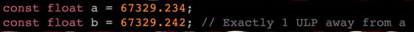
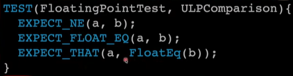
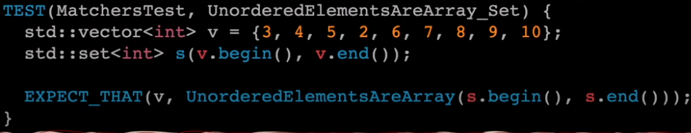

# This Documentation contains the following:
- [This Documentation contains the following:](#this-documentation-contains-the-following)
- [Matchers](#matchers)
- [Why use Matchers?](#why-use-matchers)
- [Comparison Matchers](#comparison-matchers)
  - [Generic and Numeric Comparison](#generic-and-numeric-comparison)
  - [Boolean and Pointer Comparison](#boolean-and-pointer-comparison)
  - [Reference Matcher](#reference-matcher)
  - [TypedEq Matcher](#typedeq-matcher)
  - [Wildcard](#wildcard)
- [String Matchers](#string-matchers)
  - [Regex in Matchers](#regex-in-matchers)
- [Floating-Point Matchers](#floating-point-matchers)
- [Composite Matchers](#composite-matchers)
    - [Examples:](#examples)
- [Container Matchers](#container-matchers)
- [Member Matchers](#member-matchers)
- [Pointer Matchers](#pointer-matchers)
- [Custom Matchers](#custom-matchers)
- [Custom Parametrized Matchers](#custom-parametrized-matchers)

# Matchers
A **matcher** matches a single argument.
| **Macro** | **Description**  |
| --------- | ---------------- |
| `EXPECT_THAT(actual_value, matcher)`	| Asserts that actual_value matches matcher. |
| `ASSERT_THAT(actual_value, matcher)`  |The same as EXPECT_THAT(actual_value, matcher), except that it generates a fatal failure. |

**BEST PRACTICE:** Prefer to make the comparison explicit via `EXPECT_THAT(actual_value, Eq(expected_value))` or `EXPECT_EQ(actual_value, expected_value)`.

Built-in matchers (where argument is the function argument, e.g. actual_value in the example above, or when used in the context of `EXPECT_CALL(mock_object, method(matchers))`, the arguments of method) are divided into several categories. All matchers are defined in the ::testing namespace unless otherwise noted.

# Why use Matchers?
**For example:**
We have here a test case use the matchers in different ways<br>
<br>
- **Concise** and **Readable** <br>
    **Like:**<br>
    ```c++
    EXPECT_THAT(test_string, StartWith("Hello"));
    ```
- Already **Tested**<br>
  - As `StartWith` , `MatchesRegex` and `AllOf` are tested already before and its not necessary to re-invent the wheel and implement methods already implemented.
- Can be **Chained**
    **Like:**<br>
    ```c++
    EXPECT_THAT(test_value, AllOf(Gt(0),Lt(100)));
    ```
- Can be **Customized**
  - As we can make our own matcher to use it like the matchers provided from GTest, **Like:**<br>
  

> You can use this matchers directly with `using` keyword to use the matchers from `::testing::` namespace without qualifying the namespace.

```c++
using ::testing::AllOf;
using ::testing::Gt;
using ::testing::Lt;
using ::testing::MatchesRegex;
using ::testing::StartWith;
```

# Comparison Matchers
## Generic and Numeric Comparison

| **Macro** | **Description**  |
| --------- | ---------------- |
| `Eq(value)` or `value` | 	`argument` == `value` |
| `Ge(value)`	| `argument` >= `value` | 
| `Gt(value)`	| `argument` > `value` |
| `Le(value)`	| `argument` <= `value` |
| `Lt(value)`	| `argument` < `value` |
| `Ne(value)`	| `argument` != `value` |

## Boolean and Pointer Comparison
 
| **Macro** | **Description**  |
| --------- | ---------------- |
| `IsFalse()` | `argument` evaluates to false in a Boolean context. |
| `IsTrue()`	| `argument` evaluates to true in a Boolean context. |
| `IsNull()`	| `argument` is a NULL pointer (raw or smart).|
| `NotNull()`	| `argument` is a non-null pointer (raw or smart).|

## Reference Matcher

| **Macro** | **Description**  |
| --------- | ---------------- |
| `Ref(variable)`	| `argument` is a reference to variable. |

## TypedEq Matcher

| **Macro** | **Description**  |
| --------- | ---------------- |
| `TypedEq<type>(value)`	| `argument` has type type and is equal to value. You may need to use this instead of `Eq(value)` when the mock function is overloaded.|

## Wildcard
 
| **Macro** | **Description**  |
| --------- | ---------------- |
| `_`	| `argument` can be any value of the correct type. |
| `A<type>() or An<type>()`	| `argument` can be any value of type type.|

# String Matchers
<br>
The argument can be either a C string or a C++ string object:
| **Macro** | **Description**  |
| --------- | ---------------- |
| `StrEq(string)` |	`argument` is equal to string. |
| `StrNe(string)` |	`argument` is not equal to string. |
| `StrCaseEq(string)`	| `argument` is equal to string, ignoring case. |
| `StrCaseNe(string)` |	`argument` is not equal to string, ignoring case. |
| `IsEmpty()` |	`argument` is an empty string.|

## Regex in Matchers
<br>
| **Macro** | **Description**  |
| --------- | ---------------- |
| `ContainsRegex(string)` |	`argument` matches the given regular expression. |
| `EndsWith(suffix)` | `argument` ends with string suffix. |
| `HasSubstr(string)`| `argument` contains string as a sub-string. |
| `MatchesRegex(string)` | `argument` matches the given regular expression with the match starting at the first character and ending at the last character.|
| `StartsWith(prefix)` | `argument` starts with string prefix.|

# Floating-Point Matchers
These matchers use ULP-based comparison (the same as used in googletest). They automatically pick a reasonable error bound based on the absolute value of the expected value. 

 <br>
| **Macro** | **Description**  |
| --------- | ---------------- |
| `DoubleEq(a_double)`|	`argument` is a double value approximately equal to `a_double`, treating two `NaNs` as unequal.|
| `FloatEq(a_float)`| `argument` is a float value approximately equal to `a_float`, treating two `NaNs` as unequal.|
| `NanSensitiveDoubleEq(a_double)`| `argument` is a double value approximately equal to `a_double`, treating two `NaNs` as equal.|
| `NanSensitiveFloatEq(a_float)`|	`argument` is a float value approximately equal to `a_float`, treating two `NaNs` as equal.|
| `IsNan()`| `argument` is any floating-point type with a NaN value.| 


# Composite Matchers
You can make a matcher from one or more other matchers:
| **Macro** | **Description**  |
| --------- | ---------------- |
| `AllOf(m1, m2, ..., mn)`|`argument` matches all of the matchers m1 to mn.|
| `AllOfArray({m0, m1, ..., mn})`, `AllOfArray(a_container)`, `AllOfArray(begin, end)`, `AllOfArray(array)`, or `AllOfArray(array, count)`|The same as `AllOf()` except that the matchers come from an initializer list, STL-style container, iterator range, or C-style array.|
| `AnyOf(m1, m2, ..., mn)` |`argument` matches at least one of the matchers m1 to mn.|
| `AnyOfArray({m0, m1, ..., mn})`, `AnyOfArray(a_container)`, `AnyOfArray(begin, end)`, `AnyOfArray(array)`, or `AnyOfArray(array, count)`|The same as `AnyOf()` except that the matchers come from an initializer list, STL-style container, iterator range, or C-style array.|
| `Not(m)`| `argument` doesn’t match matcher m.|
| `Conditional(cond, m1, m2)`|	Matches matcher `m1` if `cond` evaluates to true, else matches `m2`.|
### Examples:
 
You can create a vector of `Matchers` and send it to `AllOfArray` as shown in the previous picture.

# Container Matchers
| **Macro** | **Description**  |
| --------- | ---------------- |
| `ElementsAre(e0, e1, ..., en)` | `argument` has `n + 1` elements, where the i-th element matches `ei`, which can be a value or a matcher. |
| `UnorderedElementsAre(e0, e1, ..., en)`|	`argument` has `n + 1` elements, and under some permutation of the elements, each element matches an `ei` (for a different i), which can be a value or a matcher.|

**Example:**<br>
 

| **Macro** | **Description**  |
| --------- | ---------------- |
| `WhenSorted(m)`	| When `argument` is sorted using the `<` operator, it matches container matcher m. E.g. `WhenSorted(ElementsAre(1, 2, 3))` verifies that argument contains elements 1, 2, and 3, ignoring order.|
| `WhenSortedBy(comparator, m)`	| The same as `WhenSorted(m)`, except that the given comparator instead of `<` is used to sort argument. E.g. `WhenSortedBy(std::greater(), ElementsAre(3, 2, 1))`.|

**Example:**<br>


| **Macro** | **Description**  |
| --------- | ---------------- |
| `ElementsAreArray({e0, e1, ..., en})`, `ElementsAreArray(a_container)`, `ElementsAreArray(begin, end)`, `ElementsAreArray(array)`, or `ElementsAreArray(array, count)`|	The same as `ElementsAre()` except that the expected element values/matchers come from an initializer list, STL-style container, iterator range, or C-style array.|
| `UnorderedElementsAreArray({e0, e1, ..., en})`, `UnorderedElementsAreArray(a_container)`, `UnorderedElementsAreArray(begin, end)`, `UnorderedElementsAreArray(array)`, or `UnorderedElementsAreArray(array, count)`|	The same as `UnorderedElementsAre()` except that the expected element values/matchers come from an initializer list, STL-style container, iterator range, or C-style array.|

**Example:**<br>
 

| **Macro** | **Description**  |
| --------- | ---------------- |
| `Contains(e)` |	`argument` contains an element that matches `e`, which can be either a value or a matcher.|
| `Contains(e).Times(n)` | `argument` contains elements that match e, which can be either a value or a matcher, and the number of matches is `n`, which can be either a value or a matcher. Unlike the plain `Contains` and `Each` this allows to check for arbitrary occurrences including testing for absence with `Contains(e).Times(0)`. |
| `Each(e)` |	`argument` is a container where every element matches `e`, which can be either a value or a matcher.|
| `IsSubsetOf({e0, e1, ..., en})`, `IsSubsetOf(a_container)`, `IsSubsetOf(begin, end)`, `IsSubsetOf(array)`, or `IsSubsetOf(array, count)`|	`argument` matches UnorderedElementsAre`(x0, x1, ..., xk)` for some subset `{x0, x1, ..., xk}` of the expected matchers.|

**Example:**<br>
 

| **Macro** | **Description**  |
| --------- | ---------------- |
| `Pointwise(m, container)`, `Pointwise(m, {e0, e1, ..., en})`|	`argument` contains the same number of elements as in `container`, and for all i, (the i-th element in `argument`, the i-th element in `container`) match `m`, which is a matcher on 2-tuples. E.g. `Pointwise(Le(), upper_bounds)` verifies that each element in `argument` doesn’t exceed the corresponding element in `upper_bounds`. See more detail below.|

**Example:**<br>


| **Macro** | **Description**  |
| --------- | ---------------- |
| `ContainerEq(container)`| The same as `Eq(container)` except that the failure message also includes which elements are in one container but not the other.|

**Example:**<br>
<br>
The difference in error message will be like this:<br>
<br>
which is more detailed.

# Member Matchers
| **Macro** | **Description**  |
| --------- | ---------------- |
| `Key(e)`|	`argument.first` matches e, which can be either a value or a matcher. E.g. `Contains(Key(Le(5)))` can verify that a map contains a key <= 5.|
| `Pair(m1, m2)`|	`argument` is an std::pair whose first field matches m1 and second field matches m2.|
| `FieldsAre(m...)`|	`argument` is a compatible object where each field matches piecewise with the matchers `m...`. A compatible object is any that supports the `std::tuple_size<Obj>+get<I>(obj)` protocol. In C++17 and up this also supports types compatible with structured bindings, like aggregates.|

**Example:**<br>
 <br>
`FieldsAre` for Tuples and Struct:<br>
 

| **Macro** | **Description**  |
| --------- | ---------------- |
| `Field(&class::field, m)` | `argument.field` (or `argument->field` when `argument` is a plain pointer) matches matcher `m`, where `argument` is an object of type class.|
| `Field(field_name, &class::field, m)`|	The same as the two-parameter version, but provides a better error message.|
| `Property(&class::property, m)` | 	`argument.property()` (or `argument->property()` when `argument` is a plain pointer) matches matcher `m`, where `argument` is an object of type class. The method `property()` must take no argument and be declared as `const`.|
| `Property(property_name, &class::property, m)`| The same as the two-parameter version, but provides a better error message.|

**Example:**<br>
We have a class called MyClass1 <br>
<br>
We create a matcher that matches an object whose given field matches `m`<br>
<br>
**Why we use first complex one instead of the second one?** <br>
We can use it when we want to chain it with other matchers like the following example:
<br>
**Another Example:**<br>
We have a class called MyClass2 with a private member and a getter for it<br>
<br>
We create a matcher that matches an object whose given `Property` matches `m`.<br>
The method `Property()` must take no argument and be declared as `const`.<br>
 <br>
It has the same benefit as it can be chained with other matchers

# Pointer Matchers
| **Macro** | **Description**  |
| --------- | ---------------- |
| `Address(m)`|	the result of `std::addressof(argument)` matches `m`.|
| `Pointee(m)`|	`argument` (either a smart pointer or a raw pointer) points to a value that matches matcher `m`.|

**Example:**<br>
 <br>
instead of dereference we use `Pointee(m)` which help us in more complex matchers

**Another Example:**<br>
 

# Custom Matchers
We can define our own matchers to use it with composite matchers for examples and generate better reports in the output of the tests.<br>
 
| **Macro** | **Description**  |
| --------- | ---------------- |
| `MATCHER(IsEven, "") { return (arg % 2) == 0; }`| Defines a matcher `IsEven()` to match an even number.|
| `MATCHER_P(IsDivisibleBy, n, "") { *result_listener << "where the remainder is " << (arg % n); return (arg % n) == 0; }`|	Defines a matcher `IsDivisibleBy(n)` to match a number divisible by `n`.|


**Example:**<br>
```c++
  MATCHER(IsEven, "") {
    return (arg % 2) == 0;
  }


  TEST(MatchersTest, CustomMatchers){
    EXPECT_THAT(9, IsEven()); 
    EXPECT_THAT(10, Not(IsEven())); 
  }
```
The Report will be generated like this and the error description will be generated from the name of the matcher<br>


# Custom Parametrized Matchers

| **Macro** | **Description**  |
| --------- | ---------------- |
| `MATCHER_P2(IsBetween, a, b, absl::StrCat(negation ? "isn't" : "is", " between ", PrintToString(a), " and ", PrintToString(b))) { return a <= arg && arg <= b; }`|	Defines a matcher `IsBetween(a, b)` to match a value in the range [`a`, `b`].|

**Example:**<br>
```c++
  MATCHER_P2(IsBetween, a, b,
   absl::StrCat(negation ? "isn't" : "is", " between ", PrintToString(a), " and ", PrintToString(b))) {
      return a <= arg && arg <= b;
  }

  TEST(MatchersTest, CustomMatchers){
    EXPECT_THAT(100, IsBetween(9, 11)); 
    EXPECT_THAT(10, Not(IsBetween(9, 11))); 
  }
```
The Report will be generated like this and the error description will be generated according to the description string:<br>
<br>
when `negation` is `false` that means like the first line in test we should display that the expected is between 9 and 11,<br>
while it will return `true` in the second line and will display  that the expected isn't between 9 and 11

While the `result_listener` will give more information in the report like:
```c++
  MATCHER_P(IsDivisibleBy, n, ""){
    *result_listener << "Where the remainder is " << (arg % n);
    return (arg % n) == 0;
  }

  TEST(CustomMatchersTest, ExtraDescription){
    EXPECT_THAT(9, IsDivisibleBy(2)); 
    EXPECT_THAT(10, Not(IsDivisibleBy(2)));

    std::vector<int> v = {4,6,8,2};
    EXPECT_THAT(v, Each(IsDivisibleBy(2))); 
  }
```
The Report will be appear like that:<br>
