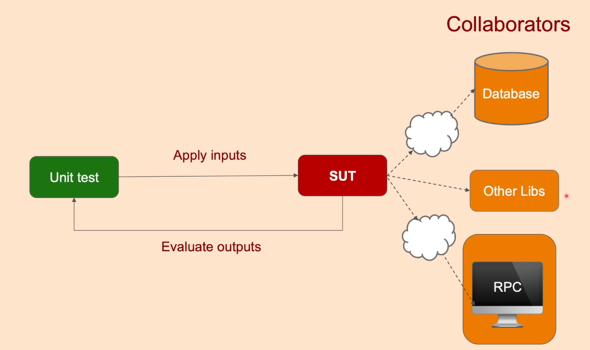
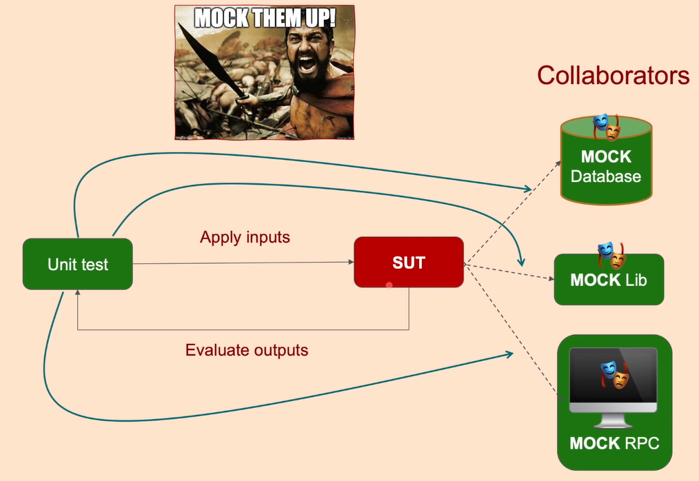

## This Documentation contains the following:
- [What is Mocking and Why we use it?](#what-is-mocking-and-why-we-use-it)
- [Test Doubles](#test-doubles)
  - [Types of Test Doubles](#types-of-test-doubles)
    - [1. Dummy](#1-dummy)
    - [2. Fake](#2-fake)
    - [3. Stub](#3-stub)
    - [4. Spy](#4-spy)
    - [5. Mock](#5-mock)

# What is Mocking and Why we use it? 
- Mocking is a process used in unit testing when the unit being tested has external dependencies.<br> 
- The purpose of mocking is to isolate and focus on the code being tested and not on the behavior or state of external dependencies.
- In mocking, the dependencies are replaced by closely controlled replacements objects that simulate the behavior of the real ones. <br>

# Test Doubles
A test double is an object that can stand in for a real object in a test, similar to how a stunt double stands in for an actor in a movie
## Types of Test Doubles
### 1. Dummy
It’s an object that will never be used in the test. <br>
Its usually done to fill the parameter list, so that the code compiles and the compiler stays happy.<br>
`Example:`
```c++
#include <gtest/gtest.h>

// Dummy class that will never be used in the test
class DummyClass {
public:
    // This class will not be used in the test
};

// Function that takes a dummy object as a parameter
void processDummyObject(DummyClass dummy) {
    // This function does nothing with the dummy object
    // It is just used to demonstrate passing a dummy object
}

// Dummy test case that involves the dummy object
TEST(DummyTest, TestWithDummyObject) {
    // Dummy object to fill the parameter list
    DummyClass dummy;
    // Call a function that takes the dummy object
    processDummyObject(dummy);
    EXPECT_TRUE(true); // Just a placeholder assertion
}
```

### 2. Fake
Fakes are functional objects with simpler implementations than the real objects they replace.<br>
They usually simplify the real implementation for testing purposes.<br>
`Example:`
```c++
#include <gtest/gtest.h>

// Interface representing an email service
class EmailService {
public:
    virtual void sendEmail(const std::string& recipient, const std::string& message) = 0;
};

// Fake implementation of the EmailService interface
class FakeEmailService : public EmailService {
public:
    void sendEmail(const std::string& recipient, const std::string& message) override {
        // Simulated email sending behavior
        std::cout << "Fake email sent to: " << recipient << std::endl;
    }
};

// Function that uses the EmailService interface
void sendNotification(EmailService& emailService, const std::string& recipient, const std::string& message) {
    emailService.sendEmail(recipient, message);
}

// Test case using the fake email service
TEST(FakeTest, TestSendNotification) {
    // Fake email service object
    FakeEmailService fakeEmailService;
    // Call the function that uses the fake email service
    sendNotification(fakeEmailService, "example@example.com", "Test message");
    EXPECT_TRUE(true); // Just a placeholder assertion
}
```

### 3. Stub
Stubs are objects that provide predefined answers to method calls.<br>
They simulate the behavior of real objects by returning specific responses when their methods are called during tests.<br>

`Example:`
```c++
#include <gtest/gtest.h>
#include <string>
#include <vector>

// Interface representing a database connection
class DatabaseConnection {
public:
    virtual std::vector<std::string> queryData(const std::string& query) = 0;
};

// Stub implementation of the DatabaseConnection interface
class StubDatabaseConnection : public DatabaseConnection {
public:
    std::vector<std::string> queryData(const std::string& query) override {
        // Simulated database query behavior
        if (query == "SELECT * FROM users") {
            return {"Alice", "Bob", "Charlie"};
        } else {
            return {}; // Return empty result for unknown queries
        }
    }
};

// Function that uses the DatabaseConnection interface
std::vector<std::string> fetchData(DatabaseConnection& dbConnection, const std::string& query) {
    return dbConnection.queryData(query);
}

// Test case using the stub database connection
TEST(StubTest, TestFetchData) {
    // Stub database connection object
    StubDatabaseConnection stubDbConnection;

    // Call the function that uses the stub database connection
    std::vector<std::string> result = fetchData(stubDbConnection, "SELECT * FROM users");
    
    // Check if the expected data is retrieved
    EXPECT_EQ(result.size(), 3);
    EXPECT_EQ(result[0], "Alice");
    EXPECT_EQ(result[1], "Bob");
    EXPECT_EQ(result[2], "Charlie");
}
```

### 4. Spy
A spy is a type of test double used in unit testing to observe the behavior of an object under test. Unlike stubs or mocks, which provide predetermined responses to method calls, a spy allows you to monitor interactions with the object being tested.<br>
**In simpler terms**, a spy records information about how methods are called during a test, such as the number of times a method is invoked, the arguments passed to it, and the order of method calls. This information can then be used to verify whether the object under test behaves as expected.<br>

`Example:`
```c++
#include <gtest/gtest.h>
#include <string>
#include <vector>

// Interface representing a calculator
class Calculator {
public:
    virtual int add(int a, int b) = 0;
    virtual int multiply(int a, int b) = 0;
};

// Spy implementation of the Calculator interface
class CalculatorSpy : public Calculator {
public:
    int add(int a, int b) override {
        addInvocationCount++;
        addArguments.push_back(std::make_pair(a, b));
        return a + b; // Simulated add operation
    }

    int multiply(int a, int b) override {
        multiplyInvocationCount++;
        multiplyArguments.push_back(std::make_pair(a, b));
        return a * b; // Simulated multiply operation
    }

    int getAddInvocationCount() const {
        return addInvocationCount;
    }

    int getMultiplyInvocationCount() const {
        return multiplyInvocationCount;
    }

    std::vector<std::pair<int, int>> getAddArguments() const {
        return addArguments;
    }

    std::vector<std::pair<int, int>> getMultiplyArguments() const {
        return multiplyArguments;
    }

private:
    int addInvocationCount = 0;
    int multiplyInvocationCount = 0;
    std::vector<std::pair<int, int>> addArguments;
    std::vector<std::pair<int, int>> multiplyArguments;
};

// Function that uses the Calculator interface
int performOperations(Calculator& calculator) {
    int result = calculator.add(3, 4);
    result *= calculator.multiply(2, 5);
    return result;
}

// Test case using the calculator spy
TEST(SpyTest, TestPerformOperations) {
    // Calculator spy object
    CalculatorSpy calculatorSpy; 

    // Call the function that uses the calculator
    int result = performOperations(calculatorSpy);
    
    // Check interactions with the calculator
    EXPECT_EQ(result, 35); // Result of (3+4) * (2*5) = 35
    EXPECT_EQ(calculatorSpy.getAddInvocationCount(), 1);
    EXPECT_EQ(calculatorSpy.getMultiplyInvocationCount(), 1);
    
    std::vector<std::pair<int, int>> addArgs = calculatorSpy.getAddArguments();
    EXPECT_EQ(addArgs.size(), 1);
    EXPECT_EQ(addArgs[0], std::make_pair(3, 4));
    
    std::vector<std::pair<int, int>> multiplyArgs = calculatorSpy.getMultiplyArguments();
    EXPECT_EQ(multiplyArgs.size(), 1);
    EXPECT_EQ(multiplyArgs[0], std::make_pair(2, 5));
}
```

### 5. Mock
Similar to a stub, but the behavior of the mocked interface can be changed dynamically based on scenarios. It is also similar to a spy, as it allows us to verify that a method was called.<br>
A mock is a smarter stub. You verify your test passes through it. so you could make a mock that returns either success or failure, success depending on the condition that could be changed in your test case.<br>

`Example:`
```c++
#include <string>
#include <gmock/gmock.h>
#include <gtest/gtest.h>

class Database {
public:
    virtual ~Database() {}
    virtual std::string getUser(int id) = 0;
};

class RealDatabase : public Database {
public:
    std::string getUser(int id) override {
        // Imagine this fetches from a real database.
        return "User_" + std::to_string(id);
    }
};

class UserService {
public:
    UserService(Database* db) : database(db) {}

    std::string fetchUser(int id) {
        return database->getUser(id);
    }

private:
    Database* database;
};

class MockDatabase : public Database {
public:
    MOCK_METHOD(std::string, getUser, (int id), (override));
};

TEST(UserServiceTest, FetchUserReturnsCorrectUser) {
    MockDatabase mockDatabase;

    // Set up the expectation
    EXPECT_CALL(mockDatabase, getUser(1))
        .Times(1) // Expect this to be called once
        .WillOnce(::testing::Return("MockedUser_1"));

    UserService userService(&mockDatabase);
    std::string user = userService.fetchUser(1);

    EXPECT_EQ(user, "MockedUser_1");
}

TEST(UserServiceTest, FetchUserReturnsDifferentUser) {
    MockDatabase mockDatabase;

    // Set up a different expectation
    EXPECT_CALL(mockDatabase, getUser(2))
        .Times(1)
        .WillOnce(::testing::Return("MockedUser_2"));

    UserService userService(&mockDatabase);
    std::string user = userService.fetchUser(2);

    EXPECT_EQ(user, "MockedUser_2");
}
```

