# This Documentation contains the following:
- [What is Unit testing?](#what-is-unit-testing)
- [Why Unit testing?](#why-unit-testing)
- [Why Test Framework?](#why-test-framework)
- [Building GTest with CMake](#building-gtest-with-cmake)
- [Our first C++ Unit test](#our-first-c-unit-test)
- [Google Test Assertion Macros](#google-test-assertion-macros)
- [Test Fixtures](#test-fixtures)
- [Manipulating Tests](#manipulating-tests)
  - [Disabling Tests](#disabling-tests)
  - [Skipping Tests](#skipping-tests)
- [Sharing Test Logic for Various Inputs](#sharing-test-logic-for-various-inputs)
- [Sharing Test Logic and inputs for Various Implementations](#sharing-test-logic-and-inputs-for-various-implementations)
- [Typed Tests](#typed-tests)

# What is Unit testing?
    - A unit test is a piece of code that tests a function or class.
    - Apply inputs (mock data) to function to evaluate actual outputs

# Why Unit testing?
    - Show that the code work as intended.
    - Provide a documentation to the function to know how it works.
    - Ensure that changes don't break things (Simple refactoring)
    - Help with finding bugs

## Lets know some Quick Definitions
### Test Suit:
    A group of logically related test cases
**E.g.** Different inputs for a function

### Fixture:
    A class factoring out common code for multiple cases
**E.g.** Setup and TearDown

### Mock Classes/Objcets:
    Simplified and lightweight classes to untangle complex dependencies while testing.

# Why Test Framework?
    - Automate the execution. -> E.g.: Implementing main()
    - Assertion, Checks and Matchers.
    - Test Organization -> E.g.: Suits and Fixtures
    - Generated Reports that origanize the results.

# Building GTest with CMake:
### Google Test requires building with the project unlike the other frameworks we include the header only
<br>

### 1- If you don’t already have CMake installed, Download it from [here](https://github.com/Kitware/CMake/releases/download/v3.30.3/cmake-3.30.3-windows-x86_64.msi) and install it.<br>

### 2- Setup of the Project
- CMake uses a file named `CMakeLists.txt` to configure the build system for a project. You’ll use this file to set up your project and declare a dependency on GoogleTest.

- Create a directory for your project: 
    ```bash
    $ mkdir my_project && cd my_project
    ```

- Next, you’ll create the `CMakeLists.txt` file and declare a dependency on GoogleTest. There are many ways to express dependencies in the CMake ecosystem but we’ll use the [FetchContent CMake module](https://cmake.org/cmake/help/latest/module/FetchContent.html) here. To do this, in your project directory (`my_project`), create a file named `CMakeLists.txt` with the following contents:
    ```cmake
    cmake_minimum_required(VERSION 3.14)
    project(my_project)

    # GoogleTest requires at least C++14
    set(CMAKE_CXX_STANDARD 14)
    set(CMAKE_CXX_STANDARD_REQUIRED ON)

    include(FetchContent)
    FetchContent_Declare(
    googletest
    URL https://github.com/google/googletest/archive/03597a01ee50ed33e9dfd640b249b4be3799d395.zip
    )
    # For Windows: Prevent overriding the parent project's compiler/linker settings
    set(gtest_force_shared_crt ON CACHE BOOL "" FORCE)
    FetchContent_MakeAvailable(googletest)
    ```
    The above configuration declares a dependency on GoogleTest which is downloaded from GitHub. In the above example, 03597a01ee50ed33e9dfd640b249b4be3799d395 is the Git commit hash of the GoogleTest version to use; we recommend updating the hash often to point to the latest version

- Create and run the binary, With GoogleTest declared as a dependency, you can use GoogleTest code within your own project.
  - As an example, create a file named `hello_test.cc` in your my_project directory with the following contents:
    ```c++
    #include <gtest/gtest.h>

    // Demonstrate some basic assertions.
    TEST(HelloTest, BasicAssertions) {
    // Expect two strings not to be equal.
    EXPECT_STRNE("hello", "world");
    // Expect equality.
    EXPECT_EQ(7 * 6, 42);
    }
    ```

- To build the code, add the following to the end of your CMakeLists.txt file:
    ```cmake
    enable_testing()

    add_executable(
    hello_test
    hello_test.cc
    )
    target_link_libraries(
    hello_test
    GTest::gtest_main
    )

    include(GoogleTest)
    gtest_discover_tests(hello_test)
    ```
    The above configuration enables testing in CMake, declares the C++ test binary you want to build (hello_test), and links it to GoogleTest (gtest_main). The last two lines enable CMake’s test runner to discover the tests included in the binary, using the [GoogleTest CMake module](https://cmake.org/cmake/help/git-stage/module/GoogleTest.html).

- Now you can build and run your test:
```bash
    my_project$ cmake -S . -B build
    -- The C compiler identification is GNU 10.2.1
    -- The CXX compiler identification is GNU 10.2.1
    ...
    -- Build files have been written to: .../my_project/build

    my_project$ cmake --build build
    Scanning dependencies of target gtest
    ...
    [100%] Built target gmock_main

    my_project$ cd build && ctest
    Test project .../my_project/build
        Start 1: HelloTest.BasicAssertions
    1/1 Test #1: HelloTest.BasicAssertions ........   Passed    0.00 sec

    100% tests passed, 0 tests failed out of 1

    Total Test time (real) =   0.01 sec
```
Congratulations! You’ve successfully built and run a test binary using GoogleTest.

# Our first C++ Unit test
Suppose we have a function that calculate the n'th Fibonacci number:
```c++
int Fib(int n)
{
    if(n <= 1)
        return n;
    
    return Fib(n - 1) * Fib(n - 2);
}
```
The test for this, is a simple file include the gtest header file with `TEST` Macro from this header file to use it to write your tests
```c++
#include "gtest/gtest.h"
TEST(FibTest,NonNegativeValues){
    EXPECT_EQ(Fib(0), 0);
    EXPECT_EQ(Fib(1), 1);
    EXPECT_EQ(Fib(5), 5);
    EXPECT_EQ(Fib(6), 8);
}

TEST(FibTest,NegativeValues){
    EXPECT_EQ(Fib(-1), 0);
    EXPECT_EQ(Fib(-10), 0);
}
```
The arguments of `TEST` Macro is the `Suit Name` which is the name specified for a group of test for the same function and the second argument is the `Test name` which is the test case name.<br>
## The test names should be:
Valid **C++ Identifiers**:
- No underscores (__).
- Test's full name is: `suit_name.test_name`.
- Tests from different test suites can have the same individual name.

# Google Test Assertion Macros:
## ASSERT vs EXPECT:
Upon failure, `EXPECT_` macros generate nonfatal failures and allow the current function to continue running, while `ASSERT_` macros generate fatal failures and abort the current function.<br>
**For example:**<br>


## Binary Comparison Assertions:
- The value arguments should be from built-in types or overload with comparison operators, otherwise a compiler error will result.
- These assertions work with both narrow and wide string objects (`string` and `wstring`).
- See also the [Floating-Point Comparison](https://google.github.io/googletest/reference/assertions.html#floating-point) assertions to compare floating-point numbers and avoid problems caused by rounding.<br>
### Like:


## Predicate Assertions:
The following assertions enable more complex predicates to be verified while printing a more clear failure message than if `EXPECT_TRUE` were used alone.
### EXPECT_PRED*
```c++
EXPECT_PRED1(pred,val1)
EXPECT_PRED2(pred,val1,val2)
EXPECT_PRED3(pred,val1,val2,val3)
EXPECT_PRED4(pred,val1,val2,val3,val4)
EXPECT_PRED5(pred,val1,val2,val3,val4,val5)

ASSERT_PRED1(pred,val1)
ASSERT_PRED2(pred,val1,val2)
ASSERT_PRED3(pred,val1,val2,val3)
ASSERT_PRED4(pred,val1,val2,val3,val4)
ASSERT_PRED5(pred,val1,val2,val3,val4,val5)
```

Verifies that the predicate `pred` returns true when passed the given values as arguments.<br>

The parameter `pred` is a function or functor that accepts as many arguments as the corresponding macro accepts values. If `pred` returns true for the given arguments, the assertion succeeds, otherwise the assertion fails.<br>

When the assertion fails, it prints the value of each argument. Arguments are always evaluated exactly once.<br>

### For example:
**Note:** In `TEST` Macro, a = 10 and b = 1000.<br>
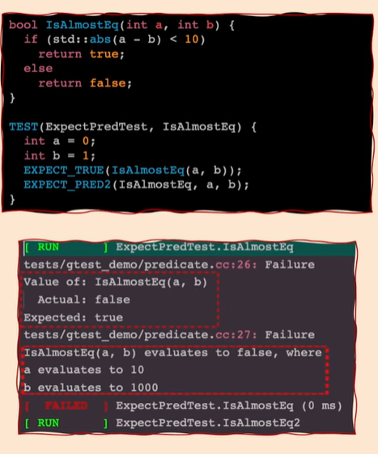

## Exception Assertions:
The following assertions verify that a piece of code throws, or does not throw, an exception. Usage requires exceptions to be enabled in the build environment.<br>
<br>
**For example:**<br>
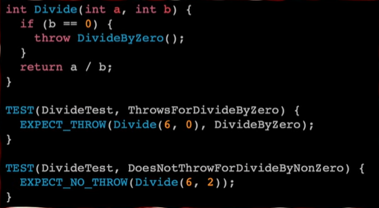

### Note:
`EXPECT_THROW` doesn't check the exception's message, and if we want to check for the message we can make it with indirect way like that:<br>
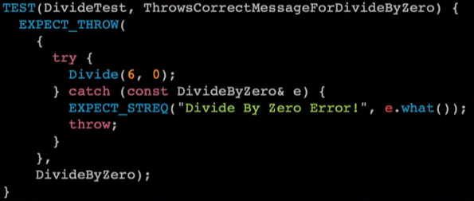<br>
- Here we try to catch the error inside `EXPECT_THROW` Macro then compare the message with the error we caught using `.what()` method then throw the error to compare it with `DivideByZero` error using the Macro.

## Death Assertions
The following assertions verify that a piece of code causes the process to terminate.
### EXPECT_DEATH
```c++
EXPECT_DEATH(statement,matcher)
ASSERT_DEATH(statement,matcher)
```
Verifies that `statement` causes the process to terminate with a nonzero exit status and produces `stderr` output that matches `matcher`.<br>

The parameter `matcher` is either a [matcher](https://google.github.io/googletest/reference/matchers.html) for a `const std::string&`, or a regular expression (see [Regular Expression Syntax](https://google.github.io/googletest/advanced.html#regular-expression-syntax))—a bare string s (with no matcher) is treated as [ContainsRegex(s)](https://google.github.io/googletest/reference/matchers.html#string-matchers), not [Eq(s)](https://google.github.io/googletest/reference/matchers.html#generic-comparison).

#### For example, the following code verifies that calling `DoSomething(42)` causes the process to die with an error message that contains the text `My error`:
```c++
EXPECT_DEATH(DoSomething(42), "My error");
```
### We can use `EXPECT_DEATH_IF_SUPPORTED` which behaves the same as `EXPECT_DEATH` if it is supported in our system. Otherwise, verifies nothing.
```c++
EXPECT_DEATH_IF_SUPPORTED(statement,matcher)
ASSERT_DEATH_IF_SUPPORTED(statement,matcher)
```

### EXPECT_EXIT
```c++
EXPECT_EXIT(statement,predicate,matcher)
ASSERT_EXIT(statement,predicate,matcher)
```
Verifies that `statement` causes the process to terminate with an exit status that satisfies `predicate`, and produces `stderr` output that matches `matcher`<br>

The parameter `predicate` is a function or functor that accepts an int exit status and returns a `bool`. GoogleTest provides two predicates to handle common cases:
```c++
// Returns true if the program exited normally with the given exit status code.
::testing::ExitedWithCode(exit_code);

// Returns true if the program was killed by the given signal.
// Not available on Windows.
::testing::KilledBySignal(signal_number)
```

For example, the following code verifies that calling `NormalExit()` causes the process to print a message containing the text `Success` to `stderr` and exit with exit status code 0:
```c++
EXPECT_EXIT(NormalExit(), testing::ExitedWithCode(0), "Success");
```

### `Example`:
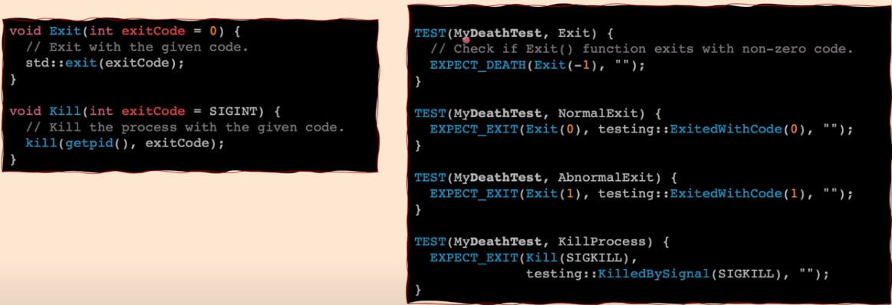<br>
**Note:**
```
Name your test suite (not test) *DeathTest since test suites with a name ending with "DeathTest" are run before all other tests.
```

# Test Fixtures:
If you find yourself writing two or more tests that operate on similar data, you can use a test fixture. This allows you to reuse the same configuration of objects for several different tests.<br>
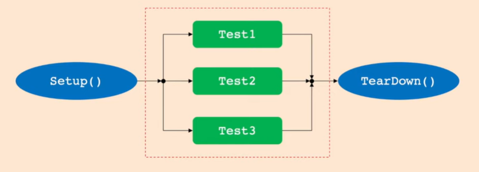<br>
## To create a fixture:
1. Derive a class from `testing::Test` . Start its body with `protected`:, as we’ll want to access fixture members from sub-classes.
2. Inside the class, declare any objects you plan to use.
3. If necessary, write a default constructor or `SetUp()` function to prepare the objects for each test. A common mistake is to spell `SetUp()` as `Setup()` with a small u - Use `override` in C++11 to make sure you spelled it correctly.
4. If necessary, write a destructor or `TearDown()` function to release any resources you allocated in `SetUp()` . To learn when you should use the constructor/destructor and when you should use `SetUp()/TearDown()`, read the [FAQ](https://google.github.io/googletest/faq.html#CtorVsSetUp).
5. If needed, define subroutines for your tests to share.<br>
```c++
class MyTestFixture : public ::testing::Test {
    protected:
    
    void SetUp() override{
        ...
    }

    void TearDown() override{
        ...
    }
};
```
When using a fixture, use `TEST_F()` instead of `TEST()` as it allows you to access objects and subroutines in the test fixture:
```c++
TEST_F(TestFixtureClassName, TestName) {
  ... test body ...
}
```
Unlike `TEST()`, in `TEST_F()` the first argument must be the name of the test fixture class. (`_F` stands for “Fixture”). No test suite name is specified for this macro.

Also, you must first define a test fixture class before using it in a `TEST_F()`, or you’ll get the compiler error “`virtual outside class declaration`”.

For each test defined with `TEST_F()`, GoogleTest will create a fresh test fixture at runtime, immediately initialize it via `SetUp()`, run the test, clean up by calling `TearDown()`, and then delete the test fixture. Note that different tests in the same test suite have different test fixture objects, and GoogleTest always deletes a test fixture before it creates the next one. GoogleTest does **not** reuse the same test fixture for multiple tests. Any changes one test makes to the fixture do not affect other tests.

## As an example, let’s write tests for a FIFO queue class named Queue, which has the following interface:
```c++
template <typename E>  // E is the element type.
class Queue {
 public:
  Queue();
  void Enqueue(const E& element);
  E* Dequeue();  // Returns NULL if the queue is empty.
  size_t size() const;
  ...
};
```
First, define a fixture class. By convention, you should give it the name `FooTest` where `Foo` is the class being tested.
```c++
class QueueTest : public testing::Test {
 protected:
  QueueTest() {
     // q0_ remains empty
     q1_.Enqueue(1);
     q2_.Enqueue(2);
     q2_.Enqueue(3);
  }

  // ~QueueTest() override = default;

  Queue<int> q0_;
  Queue<int> q1_;
  Queue<int> q2_;
};
```

In this case, we don’t need to define a destructor or a `TearDown()` method, because the implicit destructor generated by the compiler will perform all of the necessary cleanup.

Now we’ll write tests using `TEST_F()` and this fixture.
```c++
TEST_F(QueueTest, IsEmptyInitially) {
  EXPECT_EQ(q0_.size(), 0);
}

TEST_F(QueueTest, DequeueWorks) {
  int* n = q0_.Dequeue();
  EXPECT_EQ(n, nullptr);

  n = q1_.Dequeue();
  ASSERT_NE(n, nullptr);
  EXPECT_EQ(*n, 1);
  EXPECT_EQ(q1_.size(), 0);
  delete n;

  n = q2_.Dequeue();
  ASSERT_NE(n, nullptr);
  EXPECT_EQ(*n, 2);
  EXPECT_EQ(q2_.size(), 1);
  delete n;
}
```

### When these tests run, the following happens:
1. GoogleTest constructs a `QueueTest` object (let’s call it `t1`).
2. The first test (`IsEmptyInitially`) runs on `t1`.
3. `t1` is destructed.
4. The above steps are repeated on another `QueueTest` object, this time running the `DequeueWorks` test.

# Manipulating Tests
## Disabling Tests
If you want to temporarily disable tests you can use `DISABLED_` prefix before your test name like this:<br>
<br>
Also, If you want to disable your entire test fixture, You can also add `DISABLED_` prefix before your test fixture<br>
<br>
## Skipping Tests
This is another alternative of disabling test which we can skip single test or entire test fixture by using `GTEST_SKIP()` in `SetUp()` like these examples:<br>
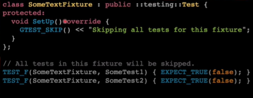


# Sharing Test Logic for Various Inputs
Suppose you have a function you want to test with various inputs with the same test logic sequence.
## Let's figure out which method is better to test these various inputs:
Suppose we have a function that sort a vector and we want to test it with different inputs.<br>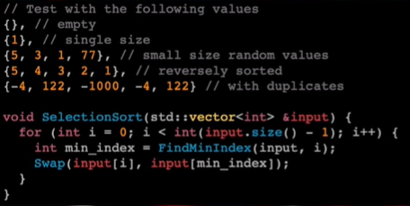<br>
### **Method 1**: `One Test Per Input`
Here we will repeat the implementation in every test case with different input values.<br>
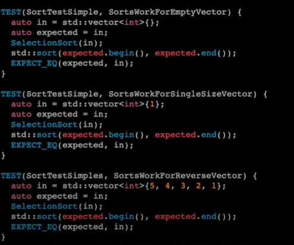<br>
and this will work fine but it is not acceptable as we shouldn't repeat ourselves as `Readability of the test code is often preferred to its conciseness`.

### **Method 2**: `Use a Test Fixture`
Here the implementation of the test case will be in the `TearDown()` of the test fixture class, But also we will write various `TEST_F()` for every input.<br>
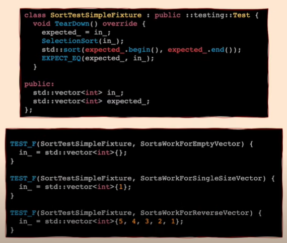<br>
But this is not the most common way to put the implementation inside the `TearDown()` as we should go to the test fixture class to check the implemetation of the test case.

### **Method 3**: `All inputs in One Test`
Here we will implement only one test case that contains all the inputs.<br>
<br>
It is acceptable and it will work but when you see the report of the test result, You will find that it will take some time to figure out which input fails if there is a failure with an input from the various inputs in the test case, and that is not ideal and usually preferred to look at the report and quickly find exactly where the test fails.

### **Method 4**: `Parameterized Test`
Here parameterized tests allow you to test your code with different parameters without writing multiple copies of the same test.
#### **To Write Value-Parameterized Tests**:
You should define a fixture class. It must be derived from both `testing::Test` and `testing::WithParamInterface<T>` (the latter is a pure interface), where `T` is the type of your parameter values.<br>
For convenience, you can just derive the fixture class from `testing::TestWithParam<T>`, which itself is derived from both `testing::Test` and `testing::WithParamInterface<T>`. `T` can be any copyable type. If it’s a raw pointer, you are responsible for managing the lifespan of the pointed values.<br>
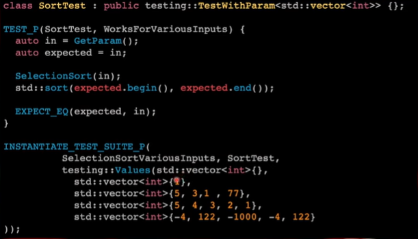<br>
#### `INSTANTIATE_TEST_SUITE_P`
```c++
INSTANTIATE_TEST_SUITE_P(InstantiationName,TestSuiteName,param_generator)
INSTANTIATE_TEST_SUITE_P(InstantiationName,TestSuiteName,param_generator,name_generator)
```
Instantiates the value-parameterized test suite `TestSuiteName` (defined with `TEST_P`).

The argument `InstantiationName` is a unique name for the instantiation of the test suite, to distinguish between multiple instantiations. In test output, the instantiation name is added as a prefix to the test suite name `TestSuiteName`.<br>
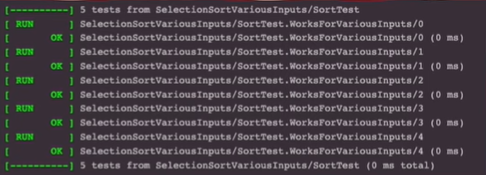<br>

The argument `param_generator` is one of the following GoogleTest-provided functions that generate the test parameters, all defined in the `::testing` namespace:
- `Range(begin, end [, step])`: Yields values `{begin, begin+step, begin+step+step, ...}`. The values do not include end. step defaults to 1.
- `Values(v1, v2, ..., vN)`: 	Yields values `{v1, v2, ..., vN}`.
- `ValuesIn(container)` or `ValuesIn(begin,end)`: Yields values from a C-style array, an STL-style container, or an iterator range `[begin, end)`.
- `Bool()`: 	Yields sequence `{false, true}`.
- `Combine(g1, g2, ..., gN)`: Yields as `std::tuple` n-tuples all combinations (Cartesian product) of the values generated by the given n generators `g1`, `g2`, …, `gN`.
- `ConvertGenerator<T>(g)`: Yields values generated by generator `g`, `static_cast` to `T`.

### **Method 5**: `Parameterized Test with Name Generator`
The optional last argument `name_generator` is a function or functor that generates custom test name suffixes based on the test parameters. The function must accept an argument of type `TestParamInfo<class ParamType>` and return a `std::string`. The test name suffix can only contain alphanumeric characters and underscores.<br>
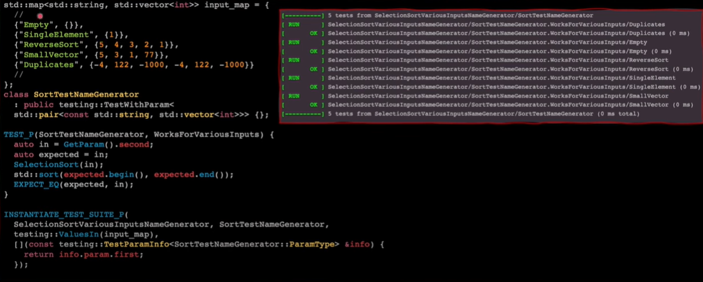<br>

# Sharing Test Logic and inputs for Various Implementations
Suppose you want to test different implementations with the same various of inputs
## Let's figure out which method is better to reach this approach:
Suppose we have two function which are `SelectionsSort` and `BubbleSort` and you need to test them with the same inputs.<br>
<br>
### **Method 1**: `Function Pointer`
Here we can write a test function that takes a pointer to function as an argument and call the function received inside it.<br>
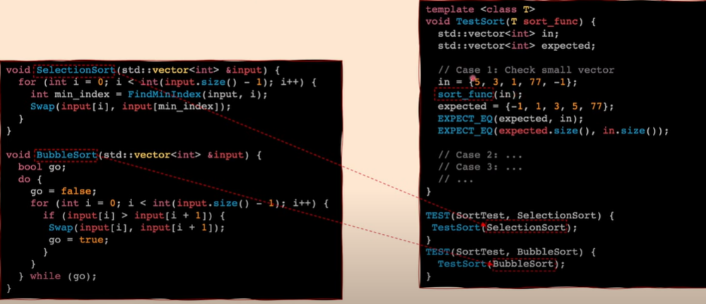<br>
but as we said before that is not ideal and usually preferred to look at the report for every input with test case.<br>
### **Method 2**: `Everything in One Test`
Here only one test will be created and inside it will contain the various inputs and a vector of functions to loop on them with the different inputs.<br>
<br>
And also as we said before it will work but when you see the report of the test result, You will find that it will take some time to figure out which input fails if there is a failure with an input.
### **Method 3**: `Parameterized Test`
We create fixture class that takes `std::function` as a parameter of `testing::TestWithParam` and use `INSTANTIATE_TEST_SUITE_P` with `testing::Values()` to test the functions you want.<br>
<br>
And use `TEST_P()` to make test cases with different inputs.<br>
<br>
and the report for this:<br>
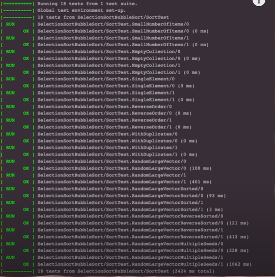<br>
As we said the best practice to use `name_generator` parameter to get a better report for the tests.<br>
<br>
Here we used lambda function to return string indicate which function run the test, Which will change the report into this:<br>
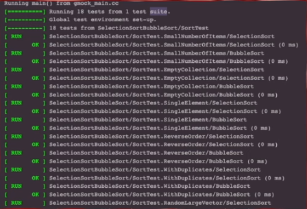<br>

### We can combine between different implementations and different inputs using `Combine` method which will combine multiple combinations of parameters.
We should first create test fixture class takes tuple of the multiple parameters we want like this:<br>
<br>
Then instantiate the test suit using `Combine` method to combine the values in the tuple like this:<br>
<br>
This `Combine` will work as a nested loop to loop over all the paramters.<br>
And that leads to create only this `TEST_P()`:<br>
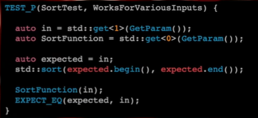<br>
we used `get<1>` from `std::` to get the second members in the parameters which is the vector inputs and `get<0>` to get the functions.<br>

And also for best practice we will use `name_generator` here like this:<br>
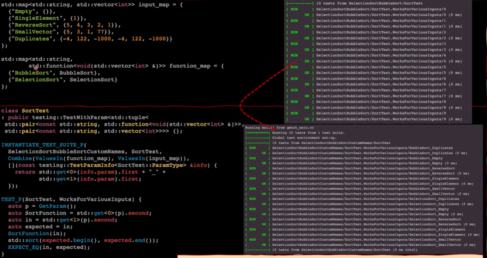<br>
We made a map that contain a string and vector and another one contains a string and function, and use them with `Combine()` method using `ValuesIn()` as it takes containers and print string for every test instead of indices as shown.
### Note:
We also changed the input of the test fixture to be tuple of pairs.

# Typed Tests
Suppose you have multiple implementations of the same interface and want to make sure that all of them satisfy some common requirements. Or, you may have defined several types that are supposed to conform to the same “concept” and you want to verify it. In both cases, you want the same test logic repeated for different types.