# What is a Computer Network?
A computer network is a system of interconnected computers and other devices (like printers, servers, and smartphones) that communicate and share resources with each other. These devices are connected using communication channels such as cables (wired) or wireless signals (Wi-Fi, Bluetooth, etc.).

  

# Why Computer Networks Are Important:
1. Resource Sharing
    > Share files, software, hardware (like printers or scanners) across devices.
2. Communication
    > Email, instant messaging, video calls, and more are all made possible by networks.
3. Centralized Data Management
    > Servers can manage data and applications centrally, improving security and efficiency.
4. Remote Access
    > Allows users to access data and systems from different locations.
5. Cost Efficiency
    > Sharing resources reduces the need for duplicate equipment or software.
6. Scalability and Flexibility
    > Easily add new devices or users to a network as your needs grow.

  

# Basic Components of a Network:
- `Nodes`: Device like computers, phones, printers, etc.
- `Transmission media`: Physical (like Ethernet cables) or wireless (like Wi-Fi).
- `Network interfaces`: Hardware (like network cards) that enable devices to connect.
- `Protocols`: Rules that define how data is transmitted (like TCP/IP).

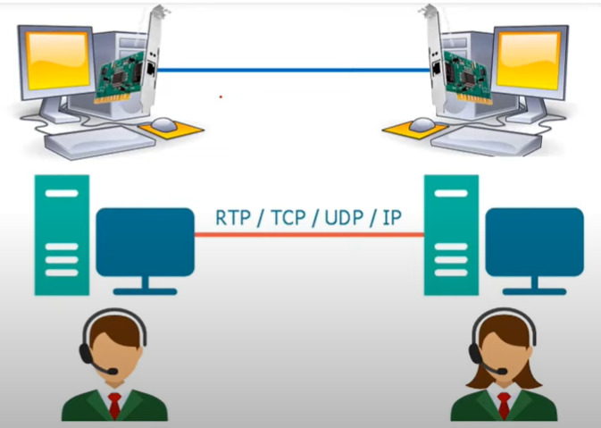

  

# Network Types:
### 1. 🌍 Geographical Area
- `LAN`, `WLAN (Wireless)`: Local Area Network which covers a small area like a room, building, or campus. 
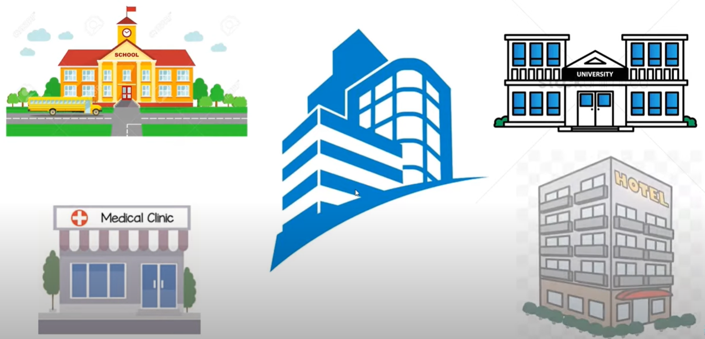 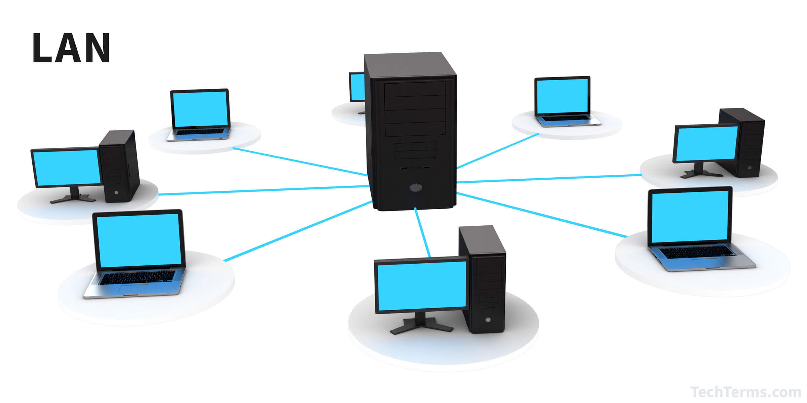

- `CAN`: Campus Area Network which interconnect multiple local area networks (LAN) within an educational or corporate campus. 
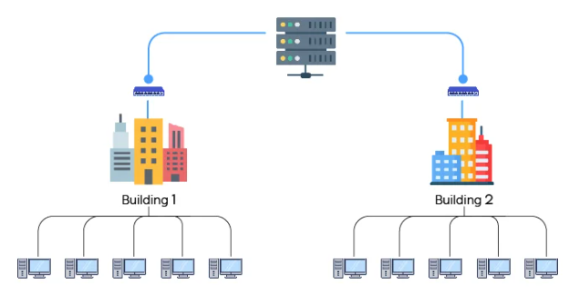

- `MAN`: Metropolitan Area Network which spans a city or large campus; connects multiple LANs. (City-wide network for a college). 
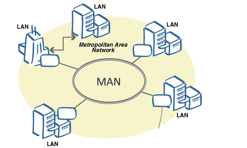

- `WAN`: Wide Area Network which connect multiple LANs with large distances between them (cities, countries, continents). 
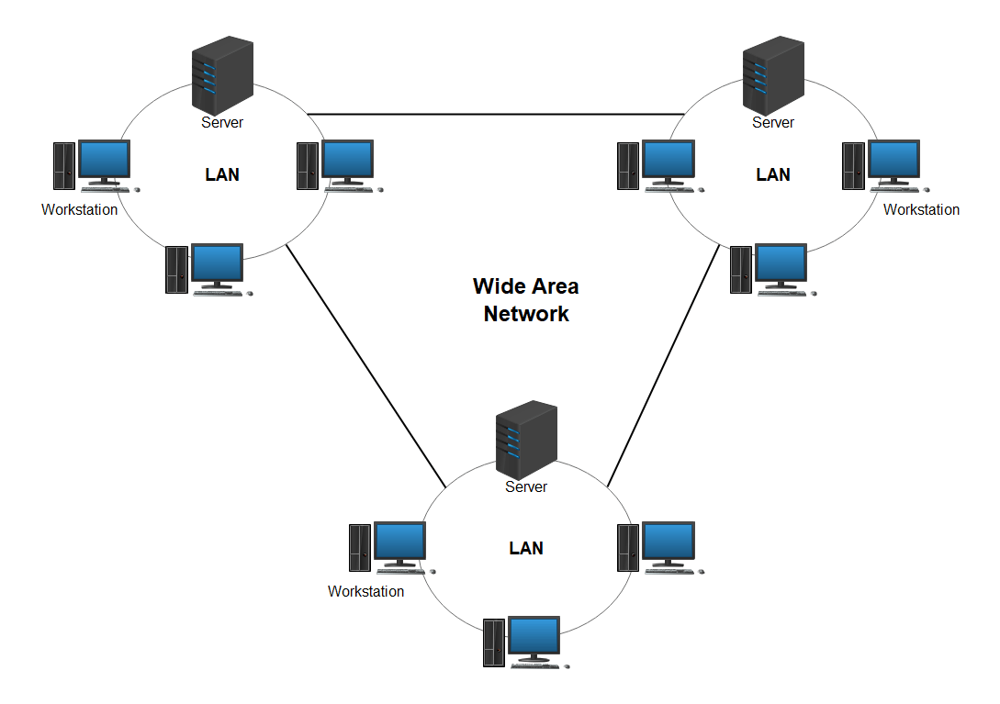

### 2. 🖥️ Host Role
- `Peer-to-Peer (P2P)`: All devices are equal; each one can act as both client and server.(`Example`: File sharing systems like BitTorrent) 
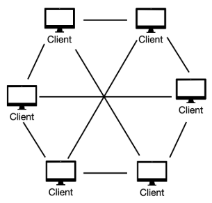

- `Client-Server`: Devices are divided into clients (ask for services) and servers (provide services).(`Example`: Web server and browser, email system) 
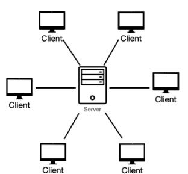

# Network Topologies:
Network topology is the layout or structure of a network, including how computers, cables, routers, and other devices are connected and communicate. 
There are two types of topology: 
- `Physical Topology `– actual layout of devices and cables.
- `Logical Topology` – how data flows through the network regardless of physical design. 
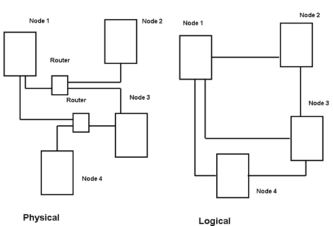

## 🕸️ Common Types of Network Topologies
### 1. Bus Topology
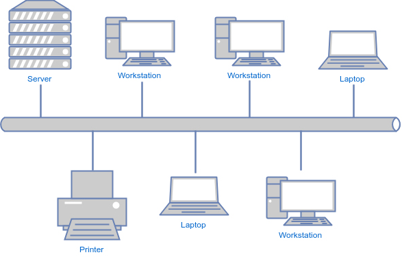 

📌 **Structure**: All devices are connected to a single central cable (called the “bus” or “backbone”), and the node will be broadcast the message and only the one who care for the message will recieve it. 
**Advantages**: 
- Easy to set up for small networks.
- Requires less cable than star topology.
- Cost-effective. 

**Disadvantages**: 
- Entire network fails if the bus fails.
- Slower performance with more devices.
- Troubleshooting is difficult.

### 2. Ring Topology
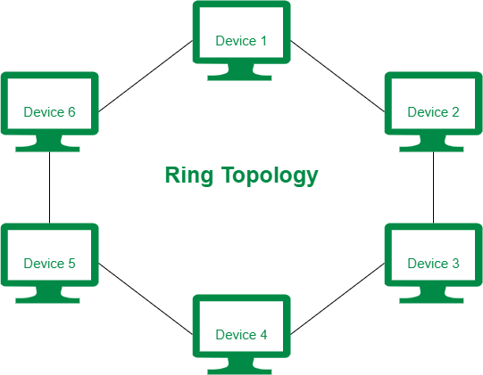 

📌 **Structure**: Each device is connected to two others, forming a circular data path. 
**Advantages**: 
- Data flows in one direction, reducing collisions.
- Good performance for moderate-sized networks. 

**Disadvantages**: 
- One failure can disrupt the entire network.
- Difficult to add or remove devices.
- Troubleshooting is harder.

### 3. Mesh Topology
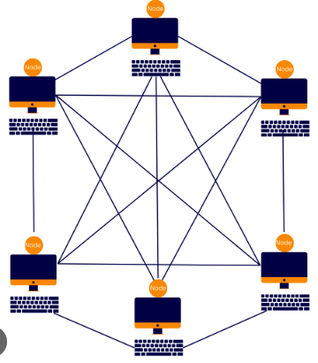 

📌 **Structure**: Every device is connected to every other device (fully connected mesh), or some devices are interconnected (partial mesh). 
**Advantages**: 
- Very reliable – one failure doesn't affect the network.
- High fault tolerance and redundancy.
- Good security and privacy. 

**Disadvantages**: 
- Very expensive (lots of cables and ports).
- Complex to set up and manage.
- Requires lots of configuration.

### 4. Star Topology
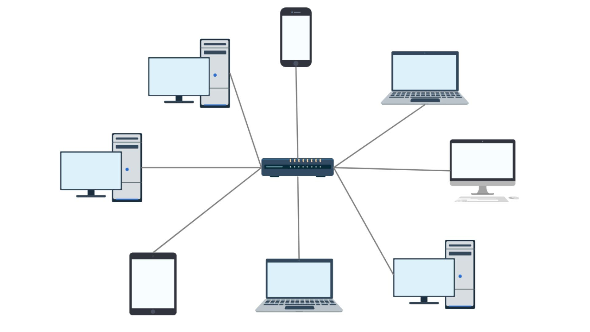 

📌 **Structure**: All devices are connected to a central device (switch or hub). 
**Advantages**: 
- Easy to install and manage.
- One device failure doesn’t affect others.
- Easy to detect faults. 

**Disadvantages**: 
- If the central device fails, the whole network goes down.
- Requires more cable.
- More expensive than bus topology.

