# What is Subnet ?
A Subnet is a smaller network within a larger network, created by dividing an IP network into multiple segments.<br>
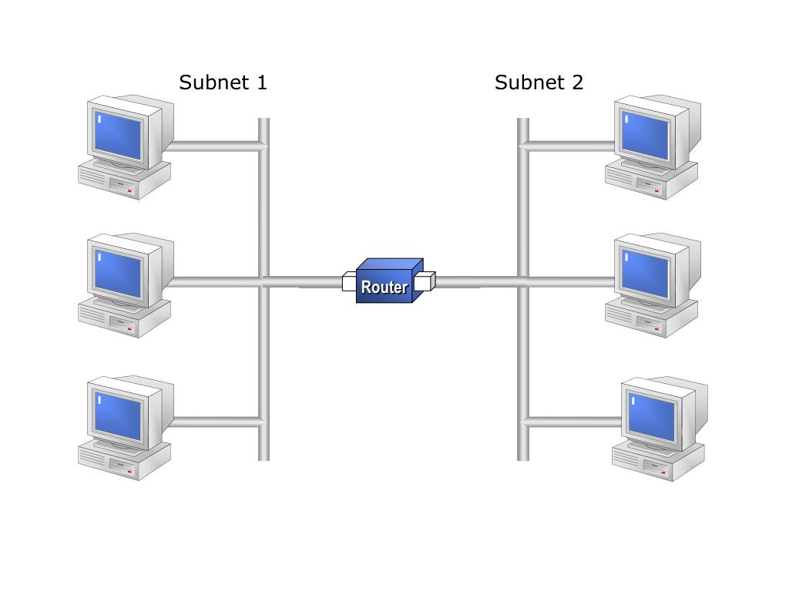<br>
Subnets help organize and manage large networks more efficiently, improve security, and optimize performance.

<br><br>

# Internet vs. Intranet vs. Extranet
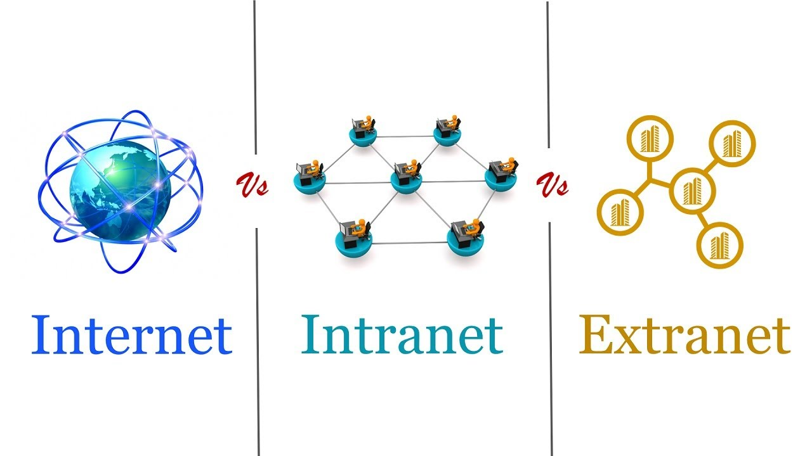<br>

## Internet:
A global network of computers that connects millions of private, public, academic, business, and government networks where ISP (**Internet Service Provider**) provides access to the Internet and act as the bridge between you (the user) and the global internet.<br>
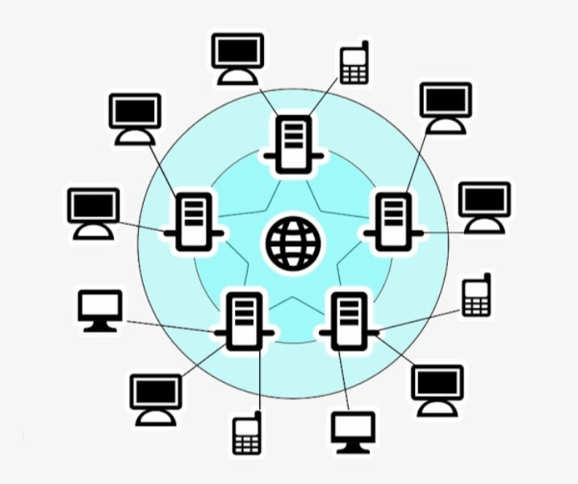<br>
`Example`: Browsing websites, watching YouTube, sending emails via Gmail.

## Intranet:
A private network used within an organization and it is only accessible to employees or members of that organization, typically protected by a firewall.<br>
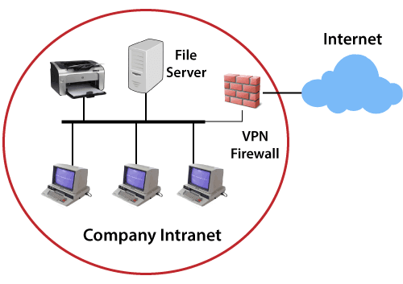<br>
`Example`: A company’s internal portal for HR, internal documents, calendars, or employee tools.

## Extranet
A private network that allows external users (like partners, vendors, or clients) limited access to parts of a company’s intranet.<br>
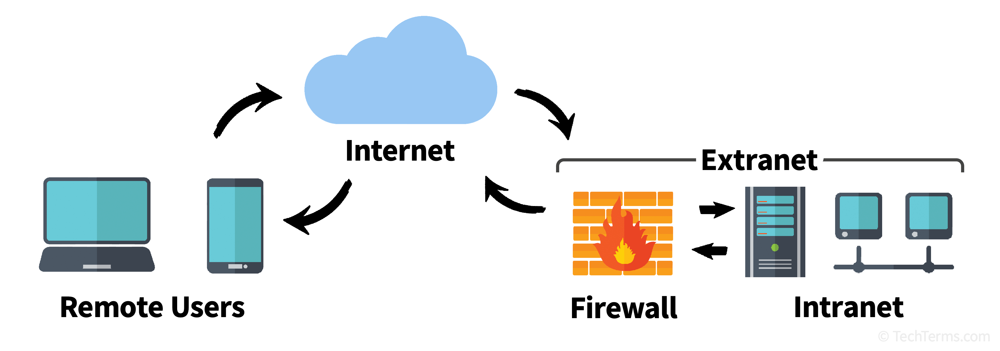<br>
`Example`: A logistics company gives its clients access only to a tracking portal through an extranet to monitor shipments in real time.

<br><br>

# Client and Server
In networks, A **client** is a device or program that `requests services or resources`, and a **server** is a device or program that `provides those services or resources` to the client.
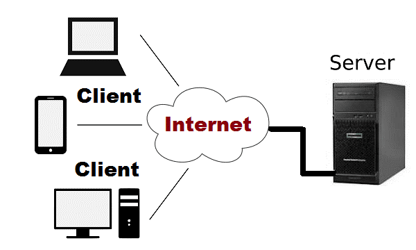<br>

<br><br>

# Servers Roles
In a network, server roles refer to the specific functions or services that a server is configured to perform. Instead of just being a general-purpose computer, a server with a defined role provides a dedicated service to other devices (clients) on the network.
## File Server:
Stores and manages files so users on the network can access, save, and share data.<br>
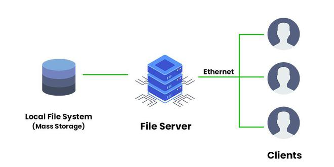<br>
`Example`: A shared drive in an office network.

## Print Server:
A Print Server is a server role that manages print requests from multiple clients on the network. Instead of every user connecting to a printer directly, they send their print jobs to the print server, which then forwards those jobs to the appropriate printer.<br>
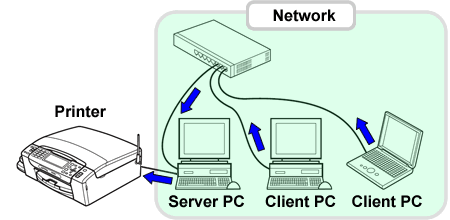<br>
`Example`: Instead of each employee installing and managing drivers for all 5 printers, They connect to one print server. The print server figures out which printer to use based on settings (like color, location, load, etc.).

## Web Server:
Hosts websites and serves web pages to clients (browsers).<br>
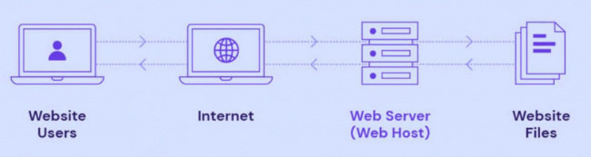<br>
`Example`: Apache, Nginx, IIS.

## Mail Server:
Sends, receives, and stores emails.<br>
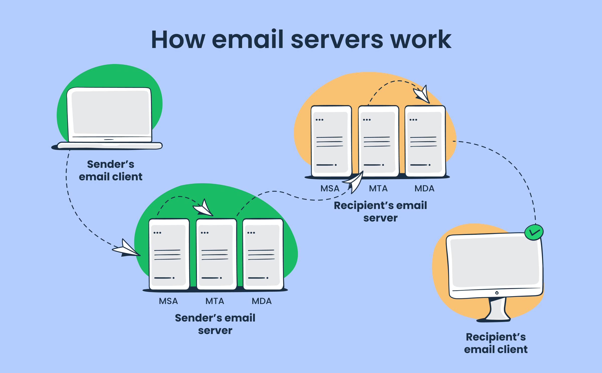<br>
`Example`: Microsoft Exchange, Postfix.

## Proxy Server:
A proxy server is like a middleman between a client (like your computer) and the internet (or another server). When you make a request—like opening a website—the proxy server handles that request on your behalf. (**Acts like a filter between your internal network and the outside world**) <br>
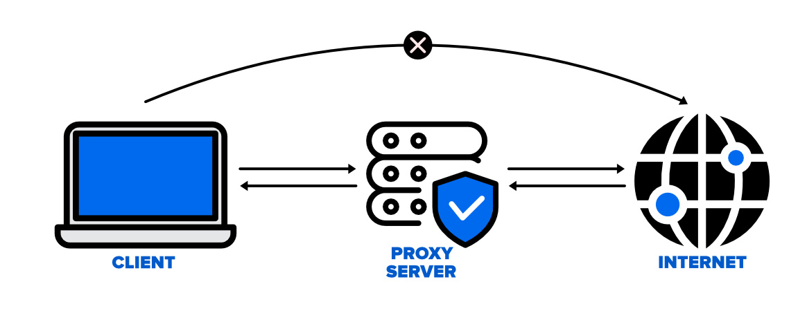<br>
`Example`: Employees browse the internet through a forward proxy, The company’s website is protected by a reverse proxy that handles external traffic.

## DNS Server
Resolves domain names (like `google.com`) into IP addresses. like the **internet’s phone book** — it translates domain names (like `google.com`) into IP addresses (like `142.250.190.78`), which computers use to talk to each other.<br>
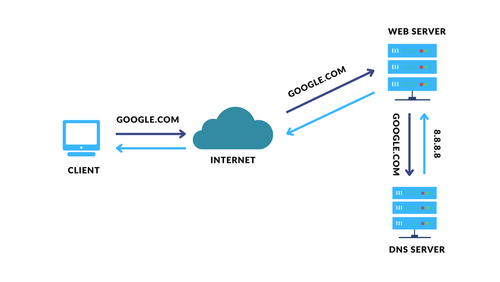<br>


## DHCP Server (Dynamic Host Configuration Protocol)
A DHCP Server is responsible for automatically assigning IP addresses and other network configuration (like gateway and DNS) to devices when they join a network.<br>
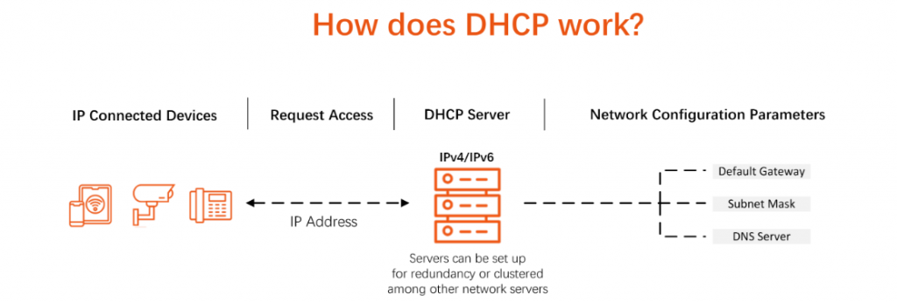<br>
`Example`: Your Wi-Fi router acts as a DHCP server, When you connect your phone or laptop, it assigns an IP like `192.168.1.20`.


# What is MAC Address?
MAC stands for Media Access Control address.<br>
A MAC address is a **unique identifier** assigned to every network interface card (`NIC`), like the one in your phone, laptop, or router. It's used for communication within the local network (`LAN`).<br>
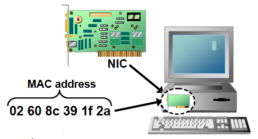<br>

### Format of a MAC Address:
It's a 48-bit address, usually written as 6 pairs of hexadecimal numbers:
```mathematica
Example: 00:1A:2B:3C:4D:5E
```
Each MAC address is:<br>
- **Globally unique** (in theory)
- **Burned into the hardware** by the manufacturer

### MAC Address Breakdown:
`00:1A:2B`:	OUI (Organizational Unique Identifier) – identifies the manufacturer (e.g., Intel, Apple)
`3C:4D:5E`:	NIC-specific – uniquely identifies the device