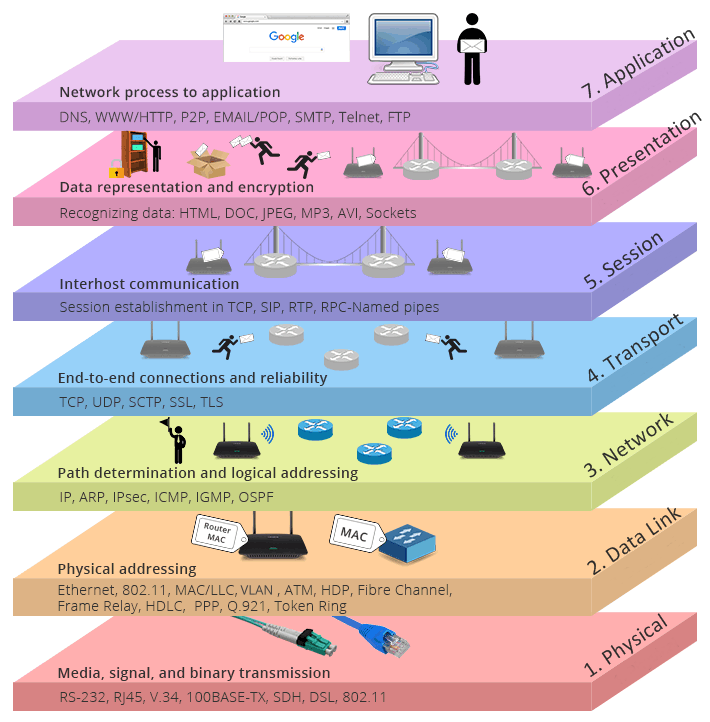
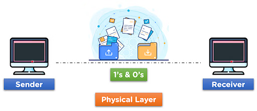
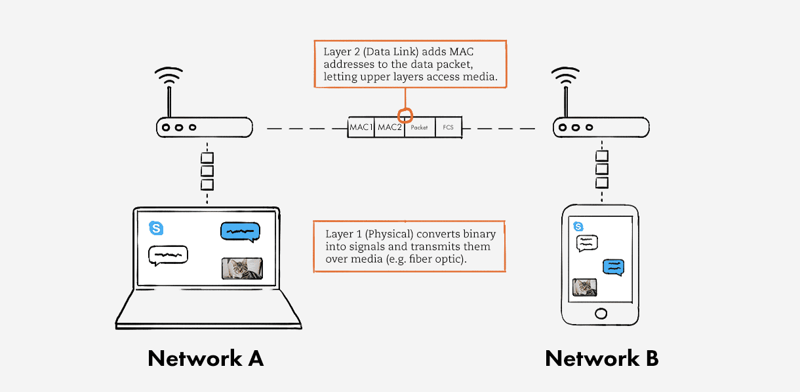
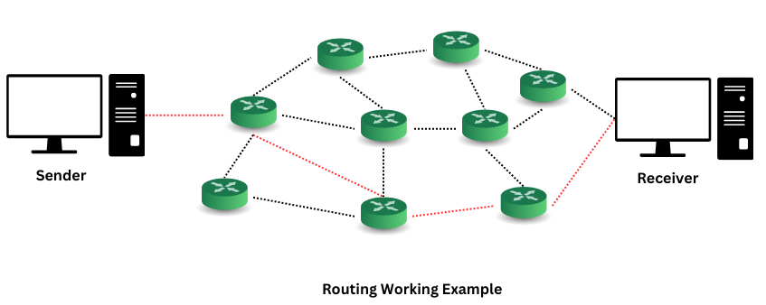
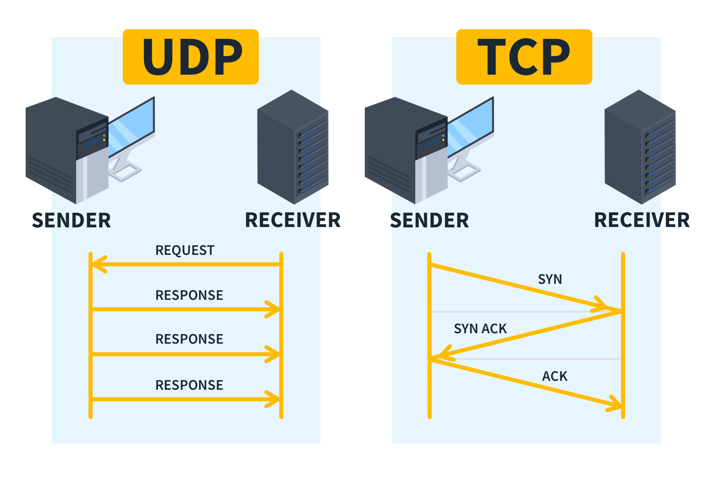
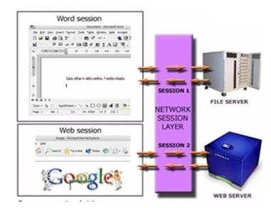
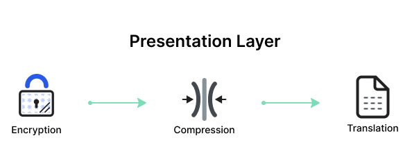
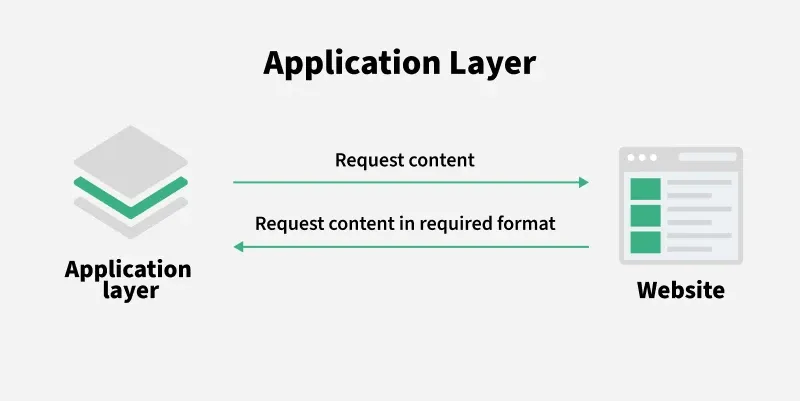

# What is OSI Model?
OSI Model (**Open Systems Interconnection Model**) is a **conceptual framework** that standardizes the functions of a telecommunication or networking system into **seven abstraction layers**. 
It was developed by the International Organization for Standardization (**ISO**) in the 1980s.

Instead of designing a whole network communication system from scratch every time, the OSI model breaks it down into logical steps — making it **easier to design**, **troubleshoot**, and **understand**.

 
Each layer in the OSI model serves the layer above it and is served by the layer below it.

# The 7 Layers of the OSI Model:
| Layer | Name | Purpose |
| ----- | -----|  -----  |
|   7   | Application | Closest to the user; interfaces directly with the software application.|
|   6   | Presentation | Translates data between the application and the network (encryption, compression, etc.).|
|   5   | Session | Manages sessions or connections between applications.|
|   4   | Transport | Reliable delivery of packets; error checking and recovery (TCP/UDP).|
|   3   | Network | Determines how data is sent to the receiving device (IP addresses, routing).|
|   2   | Data Link | Reliable transmission of data across the physical network (MAC addresses, switches).|
|   1   | Physical | Deals with the hardware transmission of raw bits over a communication channel.|

# Let’s Go Deeper Into Each Layer
## 1. Physical Layer
 

- Concerned with the **physical connection** between devices.
- Deals with **cables, switches, voltages, frequencies, etc**.
- **Examples**: Ethernet cables, fiber optics, radio signals.

## 2. Data Link Layer
 

- Makes the physical link reliable.
- **Frames data** packets and manages **MAC addresses**.
- Controls **error detection** (but not correction).
- **Examples**: Ethernet, Wi-Fi (IEEE 802.11), MAC (Media Access Control).

## 3. Network Layer
 

- Handles **logical addressing** and **routing**.
- Makes sure data gets from the **source** to the **destination** across multiple networks.
- **Example**: IP (Internet Protocol), ICMP (ping, etc.).

## 4. Transport Layer
 

- Ensures **complete data transfer**
- Responsible for **error recovery**, **flow control** and **retransmissions**.
- **Protocols**: **TCP** (Transmission Control Protocol), **UDP** (User Datagram Protocol).

## 5. Session Layer
 

- Manages **sessions** between applications.
- Opens, maintains, and closes communication sessions.
- **Example**: Login sessions, API sessions.

## 6. Presentation Layer
 

- Translates data formats between systems.
- Handles **encryption**, **decryption**, **compression**, and **serialization**.
- **Examples**: SSL/TLS encryption, JPEG images.

## 7. Application Layer
 

- Closest to the **end-user**.
- Interfaces directly with applications to provide network services.
- **Examples**: HTTP (web browsing), FTP (file transfer), SMTP (email).

# Benefits of the OSI Model
1. **Standardization**
    - Provides a common language for vendors and developers.
    - Encourages the development of **interoperable** networking equipment and software.
2. **Modularity**
    - Changes in one layer don't affect others — makes updates easier.
3. **Troubleshooting**
    - Helps network engineers systematically diagnose problems by moving layer by layer
4. **Flexibility**
    - Supports different types of networks, from Ethernet LANs to satellite communications.
5. **Vendor Neutrality**
    - Prevents lock-in to a single vendor because all devices can theoretically communicate if they follow the standards.
