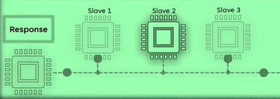
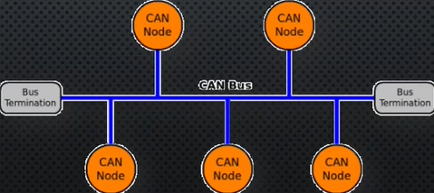
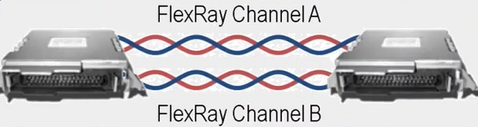
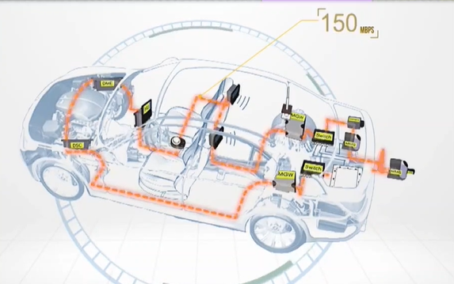
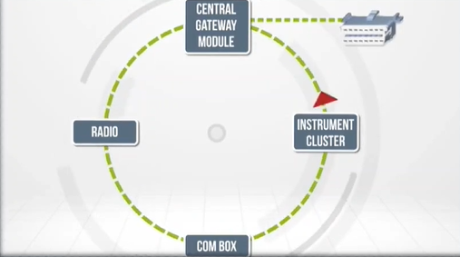
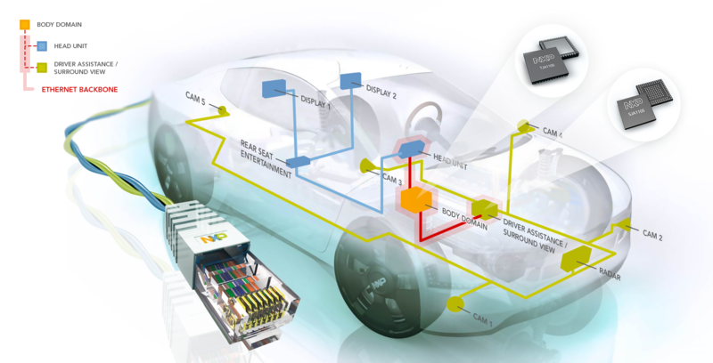

In automotive technology, **several communication protocols** are used to allow Electronic Control Units (ECUs) to talk to each other and with sensors, actuators, and infotainment systems. Each protocol has its own purpose depending on speed, cost, criticality, and data size.  

Here’s a breakdown of the most common automotive communication protocols:

# 🧩 1. LIN (Local Interconnect Network)

- `Type`: Master-slave
- `Speed`: Up to 20 kbps
- `Use Case`: Low-cost, non-critical systems like window control, mirrors, seat motors
- `Pros`: Simple, cheap, complements CAN

# 🧩 2. CAN (Controller Area Network)

- `Type`: Multi-master, message-based
- `Speed`: Up to 1 Mbps (CAN FD up to 5 Mbps)
- `Use Case`: Engine control, transmission, airbags, ABS
- `Pros`: Robust, real-time, error detection

# 🧩 3. FlexRay

- `Type`: Deterministic, time-division multiple access (TDMA)
- `Speed`: Up to 10 Mbps
- `Use Case`: Safety-critical systems (braking, steer-by-wire)
- `Pros`: Time synchronization, redundancy, high reliability

# 🧩 4. MOST (Media Oriented Systems Transport)
 
- `Type`: Ring topology for multimedia
- `Speed`: 25–150 Mbps
- `Use Case`: Infotainment systems – audio/video streaming
- `Pros`: High bandwidth, audio/video optimized

# 🧩 5. Automotive Ethernet

- `Type`: IP-based, full-duplex
- `Speed`: 100 Mbps to 10 Gbps
- `Use Case`: ADAS, cameras, infotainment, OTA updates
- `Pros`: High speed, scalable, cost-effective for data-intensive tasks

# 🚦 Comparison Table
| Protocol        | Speed         | Topology        | Use Case                              | Notes                             |
|----------------|---------------|------------------|----------------------------------------|----------------------------------|
| LIN             | Up to 20 kbps | Master-slave     | Windows, mirrors, seats                | Low cost                        |
| CAN             | Up to 1 Mbps (CAN FD: 5 Mbps) | Multi-master | Powertrain, chassis, airbags         | Robust, real-time     |
| FlexRay         | 10 Mbps       | TDMA, dual channel | Brake-by-wire, steer-by-wire          | Deterministic, reliable        |
| MOST            | 25–150 Mbps   | Ring             | Infotainment, audio/video              | High bandwidth                  |
| Ethernet        | 100 Mbps–10 Gbps | Point-to-point | ADAS, cameras, infotainment           | Fast, scalable                  |

