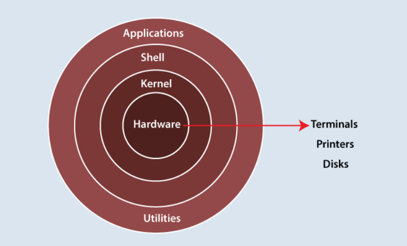
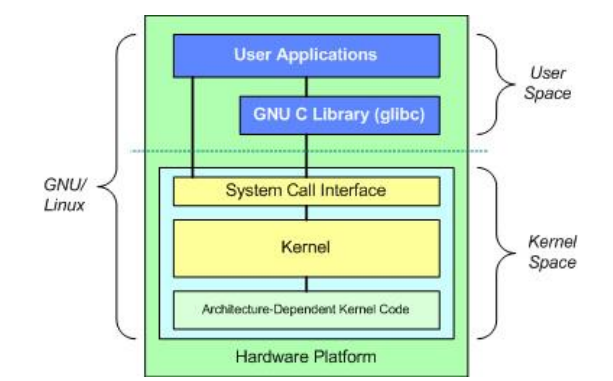
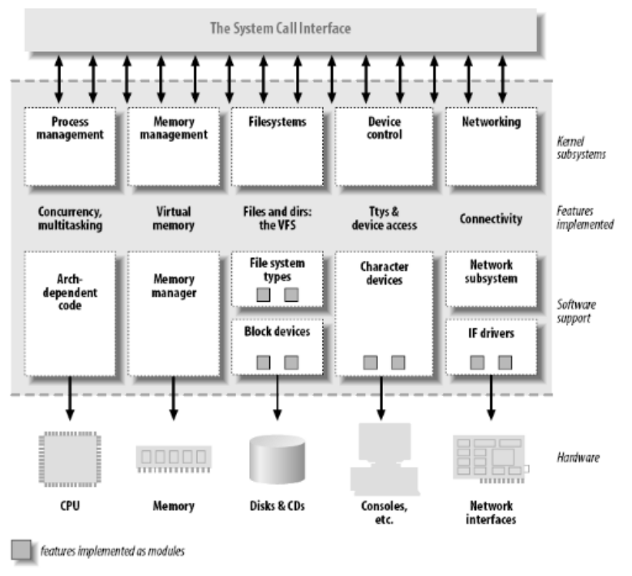
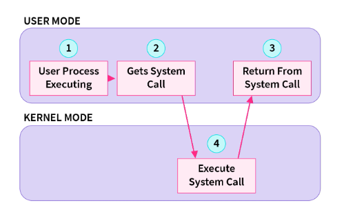
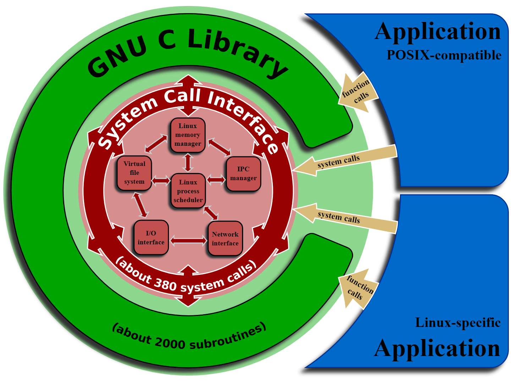
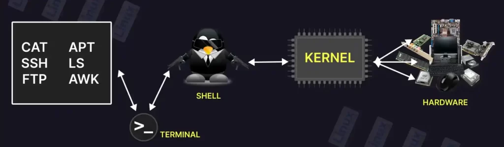

# Linux Architecture
  

## 🧱 Linux Architecture Overview
Linux architecture is layered to separate user-level interactions from system-level operations, improving security, performance, and modularity.
### 1. 🔌 Hardware Layer
- Contains the physical components: `CPU`, `RAM`, `disk`, `I/O devices`.
- TThe kernel abstracts and manages access to these hardware resources safely and efficiently.

### 2. 🧠 Kernel Layer – The Core of Linux
The Kernel is the brain of the system, responsible for managing resources and providing low-level services.. 

📌 Main Components Inside the Kernel:
| Component                             | Function                                                               |
| ------------------------------------- | ---------------------------------------------------------------------- |
| **Process Scheduler**                 | Allocates CPU to processes efficiently.                                |
| **Memory Manager**                    | Manages RAM allocation, virtual memory, and swapping.                  |
| **Virtual File System (VFS)**         | Provides a unified interface for all file systems (ext4, FAT32, etc.). |
| **Device Drivers**                    | Interface between hardware devices and the system.                     |
| **Network Stack**                     | Handles communication over LAN, Wi-Fi, internet (TCP/IP, etc.).        |
| **Inter-Process Communication (IPC)** | Supports process communication via pipes, signals, shared memory.      |
| **Security Modules**                  | Controls permissions and access (e.g., SELinux, AppArmor).             |

### 3. 🔁 System Call Interface (SCI)

- Acts as a gateway between user space and kernel space.
- Applications use system calls to request kernel services.
- Example system calls: `open()`, `read()`, `write()`, `fork()`, `exec()`.

### 4. 📚 System Libraries

- Provide standard functions that wrap system calls.
- Help user applications communicate with the kernel without dealing with low-level operations directly.
- Example: `glibc` (GNU C Library) handles memory, string operations, threading, and more.

### 5. Shell / User Interface

- Interfaces for user interaction with the system:
  - **CLI**: `bash`, `zsh`, `fish`
  - **GUI**: `GNOME`, `KDE`, `XFCE`
- Shells interpret user commands and invoke system functions through libraries.

### 6. User Applications
- Tools and apps like `vim`, `firefox`, `docker`, etc.
- Run in user space and use libraries and system calls to perform operations.

 

# 🧩 Linux Distributions (User Space Layer)
A Linux distribution (distro) is a complete operating system built using:
- The Linux kernel
- GNU tools and libraries
- Additional software (utilities, package managers, GUI, etc.)
- Desktop environments and window managers (optional)
- Installation and update tools
- Documentation

## Examples:
| Distro Name          | Purpose / Specialty                                                  |
| -------------------- | -------------------------------------------------------------------- |
| **Ubuntu**           | Beginner-friendly, general purpose                                   |
| **Linux Mint**       | Lightweight and user-friendly                                        |
| **Debian**           | Stable and open-source focused                                       |
| **Red Hat / CentOS** | Enterprise-grade with long-term support                              |
| **Fedora**           | Cutting-edge features, community-driven                              |
| **Arch Linux**       | DIY, minimal, rolling release                                        |
| **Yocto (Project)**  | Not a distro — a **tool** to build custom Linux for embedded systems |

## 🧵 Note on Yocto Project
**Yocto** is not a Linux distribution itself. 
It is a **build system** used to create custom embedded Linux distributions tailored to specific hardware and software requirements.