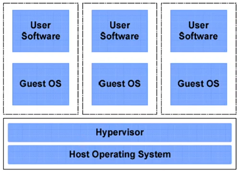
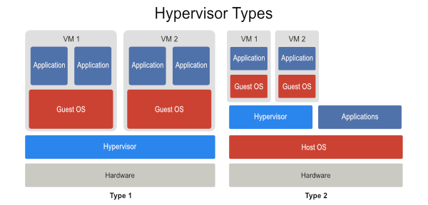

# 🧱 What is Virtualization?
Virtualization is the process of creating virtual versions of physical components, such as operating systems, servers, storage devices, or networks—on top of existing hardware using a layer called a hypervisor.

## 🧩 How It Works:
- A virtualization layer (**hypervisor**) runs directly on hardware (**bare metal**) or on a **host OS**.
- It allows multiple **Virtual Machines (VMs)** to share the same physical hardware resources.
- Each VM runs its own OS, like Linux or Windows, but uses **the same CPU architecture** as the host.

## 🧰 Hypervisors:

| Type                    | Examples                                         | Description               |
| ----------------------- | ------------------------------------------------ | ------------------------- |
| **Type 1** (Bare Metal) | `VMware ESXi`, `Microsoft Hyper-V`, `KVM`, `Xen` | Runs directly on hardware |
| **Type 2** (Hosted)     | `VirtualBox`, `VMware Workstation`               | Runs on top of a host OS  |

# 🧪 What is Emulation?
Emulation is the process of mimicking **hardware or software environments**, often with a different architecture than the host machine.

## 🧩 How It Works:
- Emulators simulate **both hardware** and **CPU instructions**.
- Useful for running software designed for a **different CPU architecture** (e.g., ARM on x86).
- Slower than virtualization because **every instruction is translated** to the hardware instuction of the device you work on it.

## 🧰 Examples of Emulation:
| Tool                              | Emulates                   | Use Case                                         |
| --------------------------------- | -------------------------- | ------------------------------------------------ |
| **QEMU (in full emulation mode)** | Different CPU architecture | Running ARM or MIPS code on x86 PC               |
| **Bochs**                         | Full x86 emulator          | Low-level OS debugging                           |
| **Dolphin**                       | GameCube/Wii hardware      | Gaming                                           |
| **Wine**                          | Windows API on Linux       | Lets Linux run Windows apps (not full emulation) |
| **Android Emulator**              | ARM environment            | Android app testing                              |

# 🔍 Key Differences Between Virtualization and Emulation
| Feature              | Virtualization                       | Emulation                                    |
| -------------------- | ------------------------------------ | -------------------------------------------- |
| **CPU Architecture** | Same as host                         | Can be different from host                   |
| **Performance**      | Near-native speed                    | Much slower                                  |
| **Use Cases**        | Servers, cloud, testing, VMs         | Debugging, cross-platform dev, game consoles |
| **Flexibility**      | Less flexible in hardware simulation | Can simulate any hardware (e.g., ARM on x86) |
| **Examples**         | VirtualBox, KVM, VMware              | QEMU (full emulation), Bochs, Dolphin        |

# 🛠 Real-World Use Cases
| Use Case                   | Use            | Technology          |
| -------------------------- | -------------- | ------------------- |
| Run multiple Linux VMs     | Virtualization | KVM / VirtualBox    |
| Test Android apps on PC    | Emulation      | Android Emulator    |
| Run Windows on Linux       | Virtualization | VMware / VirtualBox |
| Run ARM firmware on x86 PC | Emulation      | QEMU                |
| Simulate old game consoles | Emulation      | Dolphin, SNES9x     |
